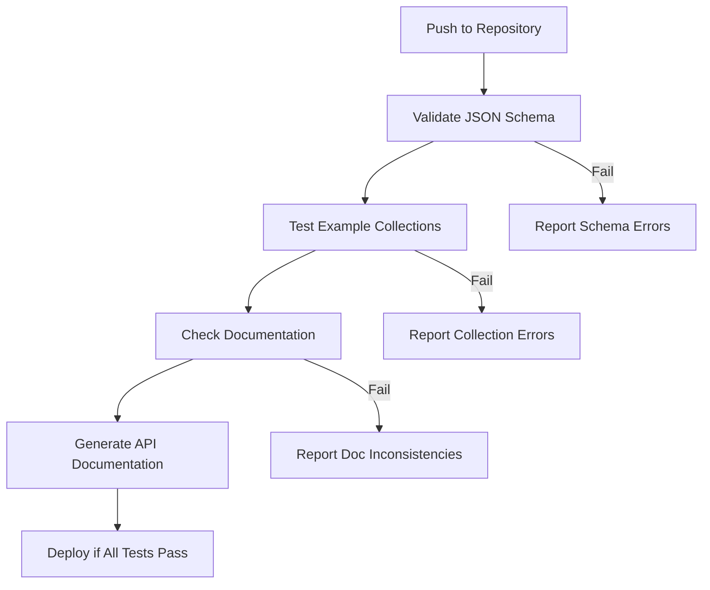

# Example Collections

The examples in this repository serve two important purposes:

1. **Reference Collections for Monty API**
2. **Collection Documentation Validation**

## Reference Collections for Monty API

The example collections in this repository serve as reference implementations for the [Monty API](https://github.com/IFRCGo/monty-eoapi). They demonstrate:

- Proper STAC collection structure for various data sources
- Correct implementation of the Monty extension
- Valid use of field values and data types
- Relationships between different types of data (events, hazards, impacts)

### Collection Types

Each data source has its own set of collections:

1. **Events Collections**
    - Define disaster events from various sources
    - Example: [Reference Events Collection](https://github.com/IFRCGo/monty-stac-extension/tree/main/examples/reference-events/reference-events.json)
    - Used for event correlation and data integration

2. **Hazards Collections**
    - Contain hazard-specific data
    - Example: [GDACS Hazards Collection](https://github.com/IFRCGo/monty-stac-extension/tree/main/examples/gdacs-hazards/gdacs-hazards.json)
    - Define severity, intensity, and other hazard characteristics

3. **Impacts Collections**
    - Document the effects of hazards
    - Example: [IDMC GIDD Impacts Collection](https://github.com/IFRCGo/monty-stac-extension/tree/main/examples/idmc-gidd-impacts/idmc-gidd-impacts.json)
    - Track casualties, displacement, and other impact metrics

## Collection Documentation Validation

The example collections play a crucial role in the CI/CD workflow:

1. **Schema Validation**
    - Examples are validated against the [JSON Schema](https://github.com/IFRCGo/monty-stac-extension/tree/main/json-schema/schema.json)
    - Ensures compliance with the STAC specification
    - Verifies Monty extension requirements

2. **Documentation Testing**
    - Examples are used to test documentation accuracy
    - Verify that documentation reflects actual implementation
    - Ensure examples are in sync with schema changes

3. **Integration Testing**
    - Used to test the Monty API's ability to:
        - Parse different collection types
        - Handle various data structures
        - Maintain relationships between items

### CI/CD Process

The validation process in the CI/CD workflow:

