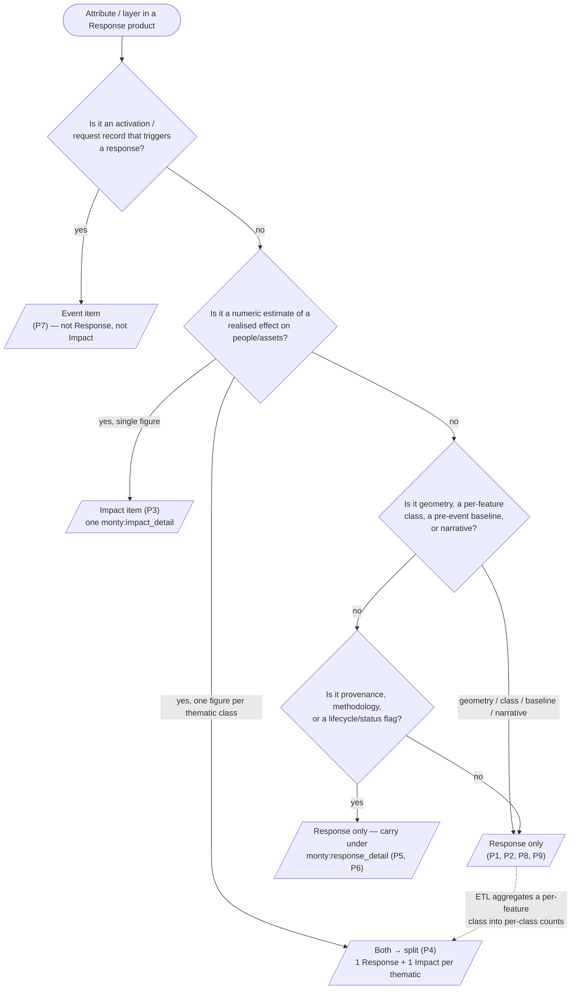

# Response ↔ Impact Boundary Rules

> **Status:** Boundary-rules document accompanying the v1.3 `monty:response_detail` model. It complements [Response Best Practices](response-best-practices.md) by specifying **how to decide, per piece of data, whether something belongs on a Response item, on a paired Impact item, or on neither**.

The overlap between **Response** and **Impact** is the most common source of ETL modelling
confusion. A CEMS Grading Product that reports "200 buildings destroyed" is unambiguously a
**Response** product — an action was taken to produce it — but the building-damage count itself is
**Impact** data. Without explicit rules, two ETL authors will model the same source record
differently.

This document publishes a **source-agnostic** decision procedure: a catalogue of recurring data
patterns, a decision tree an ETL author runs per attribute/layer, the splitting algorithm and exact
link block to emit, and the queries that re-pair the two halves.

- **Response** = an *action taken or product produced* in response to a disaster (a CEMS map, a Charter VAP, a UNOSAT assessment, an IFRC DREF).
- **Impact** = an *estimated/realised effect on people or assets* (deaths, people affected, buildings destroyed, economic loss).

> **Scope.** This document is **source-agnostic**. Per-source data-element classification (which
> Charter / CEMS / UNOSAT / IFRC attribute maps to which pattern) belongs to the analysis
> deliverable of each source epic, which applies the pattern catalogue below. The governing
> principle — *"statistical figures go to Impact items"* — is stated in
> [Response Best Practices §1.5](response-best-practices.md#1-governing-principles); this document
> operationalises it.

---

## 1. Pattern catalogue

Run this catalogue over **each attribute, layer, or table** carried by an incoming response product.
For every piece of data, find the matching pattern and apply its modelling outcome. The catalogue is
non-exhaustive; refine it as new source patterns appear.

| # | Data pattern in a Response product | Examples (any source) | Modelling outcome |
|---|---|---|---|
| **P1** | **Geometry-only delineation** — a polygon/raster describing event extent, with no per-feature attributes beyond geometry | Flood-extent polygon, fire perimeter, ash-fall area | **Response only.** Geometry on the Response item; no Impact derived. |
| **P2** | **Categorical classification per feature** — polygons/pixels carry a hazard or damage *class* but no numeric estimate of effect | Damage grade per building polygon (`none` / `minor` / `major` / `destroyed`); `flooded` / `not flooded` per pixel | **Response only** when the class is intrinsic to the product. **Both → split** if the ETL aggregates the classification into a per-class **count** (the count becomes the Impact, see P4). |
| **P3** | **Numeric estimate of effect on people/assets** — a quantitative figure in human/asset units, regardless of how it was produced | `affected_population: 12300`, `buildings_destroyed: 87`, `hectares_flooded: 1450`, `economic_loss_usd: 2.5e6` | **Impact.** Always becomes one or more Impact items; **never** carried under `monty:response_detail`. |
| **P4** | **Multi-thematic statistics table** — one numeric estimate per thematic class | CEMS GRA `affected` / `total` per thematic (population, buildings, roads, …) | **Both → split:** one Response item **+ one Impact item per thematic class.** |
| **P5** | **Provenance / methodology metadata** — analyst, method, software, sensor, processing chain | `producer`, `methodology`, `processing:software`, `sat:platform` on linked acquisitions | **Response only.** Carried under `monty:response_detail.producer` / `methodology` (or on the linked acquisition item for sensor metadata). |
| **P6** | **Lifecycle / status flag** — production state of the product itself | CEMS `statusCode`, monitoring iteration number | **Response only.** Carried under `monty:response_detail.status` / `monitoring_number`. |
| **P7** | **Activation / request record** — an administrative entry that *triggers* a response but is not itself a product | Charter activation record, CEMS activation event | **Neither Response nor Impact — it is an Event.** Modelled as a Monty Event item. (See [Response Best Practices §3.2](response-best-practices.md#32-international-charter): Charter activations are Events; only VAPs are Responses.) |
| **P8** | **Free-text narrative / situational summary** with no machine-readable figures | CEMS Situational Report prose, UNOSAT report PDF | **Response only.** Carries the narrative as an asset. Any figures a human/NLP step extracts from it are then modelled as Impact items in addition (P3). |
| **P9** | **Pre-event baseline** — reference data of assets/exposure *before* the event | CEMS Reference Map, pre-event population layer | **Response only.** `monty:response_detail.type = eo-ref`. Exposure baselines are **not** Impact items — no realised effect has occurred. |

**Key distinction P3 vs. P9:** a numeric figure is Impact (P3) only when it expresses a *realised
effect of the event*. A pre-event exposure baseline (P9) is the same kind of number measured *before*
the event and stays on the Response item.

---

## 2. Decision tree

Apply this per attribute/layer. It resolves every catalogue pattern to one of four outcomes:
**Event**, **Response only**, **Impact**, or **Both → split**.



**Prose fallback (run top to bottom, first match wins):**

1. **Activation / request record?** → **Event** item (P7). Stop.
2. **Numeric estimate of a realised effect** on people/assets?
   - Single figure → **Impact** item (P3).
   - One figure per thematic class (a statistics table) → **Both → split** (P4): one Response item + one Impact item per thematic.
3. **Geometry, per-feature class, pre-event baseline, or free-text narrative?** → **Response only** (P1, P2, P8, P9). *If the ETL later aggregates a per-feature class into per-class counts, those counts re-enter at step 2 as Impacts.*
4. **Provenance, methodology, or a lifecycle/status flag?** → **Response only**, carried under the relevant `monty:response_detail` field (P5, P6).

---

## 3. ETL splitting guidance — when and how to split a source record

When a source product matches **P3** or **P4** (it carries realised-effect figures), the ETL
transformer splits the incoming record into one Response item plus one or more Impact items.

### 3.1 Algorithm

For each incoming source product:

1. **Emit one Response item.** Carry the product type, lifecycle, provenance, geometry, and assets
   per [Response Best Practices](response-best-practices.md). Do **not** put any realised-effect
   figure under `monty:response_detail`.
2. **For each numeric thematic** in the source (P4: one per thematic class; P3: the single figure),
   **emit one Impact item** carrying that single figure in `monty:impact_detail`.
3. On every Impact item, add the **`derived_from` → Response** link block (§3.3).
4. Set the **same `monty:corr_id`** on the Response item and on every paired Impact item.

### 3.2 ID and `corr_id` conventions (idempotent re-pairing)

So that re-running the ETL re-pairs the same items instead of creating duplicates:

- **Shared `monty:corr_id`** on the Response and all its Impacts is the durable join key. Reuse the
  existing Monty `corr_id` format `YYYYMMDDTHHMMSSZ-CCC-HAZ-EPISODE-PROVIDER`.
- **Deterministic item ids.** Derive Impact ids from the Response `source_id` + thematic, e.g.
  `<source_id>-<thematic>-<impact_type>` (`EMSR-DEMO-001-buildings-destroyed`). Re-runs produce the
  same id → the catalog upserts rather than duplicating.
- Keep `monty:country_codes` and `monty:hazard_codes` consistent across the paired items.

### 3.3 Exact link block to emit on each Impact item

The canonical provenance edge runs **Impact → Response** (see
[Response Best Practices §6](response-best-practices.md#6-linkage-summary)). On every Impact item:

```jsonc
{
  "rel": "derived_from",
  "href": "response-EMSR-DEMO-001-GRA.json",
  "type": "application/geo+json",
  "roles": ["response"]
}
```

The reverse edge (Response → `rel: related` with `roles: ["impact"]` to each Impact) is an
**optional back-reference** only; the `derived_from` link above plus the shared `corr_id` are the
authoritative linkage.

### 3.4 Multi-thematic products (P4)

A CEMS GRA-style statistics table with figures for population, buildings, and roads becomes **one
Response item and three Impact items** — never a single Impact item bundling all thematics, and never
the figures stuffed into `monty:response_detail`. Each Impact item carries exactly one
`monty:impact_detail` object. See the worked fixture under
[`examples/_response-impact-pairing/`](../../examples/_response-impact-pairing/), which exercises this
pattern (one `eo-gra` Response → two thematic Impacts).

---

## 4. Query perspective — re-pairing the two halves

A STAC API consumer reconstructs the paired record using the shared `monty:corr_id` and the
`derived_from` link. Examples use `cql2-json`, consistent with the
[STAC API correlation examples](stac-api/correlation_examples.md).

### 4.1 Return both halves of a paired record

All items (Response + Impacts) sharing a `monty:corr_id`:

```json
{
  "filter-lang": "cql2-json",
  "filter": {
    "op": "=",
    "args": [
      {"property": "monty:corr_id"},
      "20260615T000000Z-DEMO-FL-001-DEMO"
    ]
  }
}
```

### 4.2 Given a Response, find its downstream Impacts

```json
{
  "filter-lang": "cql2-json",
  "filter": {
    "op": "and",
    "args": [
      {
        "op": "=",
        "args": [{"property": "monty:corr_id"}, "20260615T000000Z-DEMO-FL-001-DEMO"]
      },
      {
        "op": "in",
        "args": ["impact", {"property": "roles"}]
      }
    ]
  }
}
```

### 4.3 Given an Impact, find its source Response

Two equivalent strategies:

- **Follow the link (authoritative):** read the Impact item's `links`, take the entry with
  `rel: derived_from` and `roles: ["response"]`, and dereference its `href`.
- **Filter by `corr_id` + role:** same query as §4.2 with the `roles` arg set to `"response"`:

```json
{
  "filter-lang": "cql2-json",
  "filter": {
    "op": "and",
    "args": [
      {
        "op": "=",
        "args": [{"property": "monty:corr_id"}, "20260615T000000Z-DEMO-FL-001-DEMO"]
      },
      {
        "op": "in",
        "args": ["response", {"property": "roles"}]
      }
    ]
  }
}
```

---

## See also

- [Response Best Practices](response-best-practices.md) — extension layering, field carriage per source, anti-patterns, and the linkage summary.
- [Response Taxonomy](response-taxonomy.md) — response type codes and the Sendai crosswalk.
- [STAC API correlation examples](stac-api/correlation_examples.md) — broader CQL2 correlation patterns.
- [`examples/_response-impact-pairing/`](../../examples/_response-impact-pairing/) — synthetic Response+Impact fixture exercising pattern P4.
