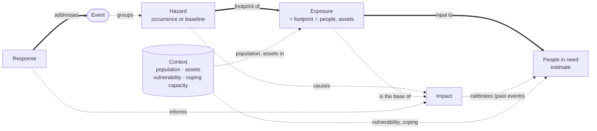
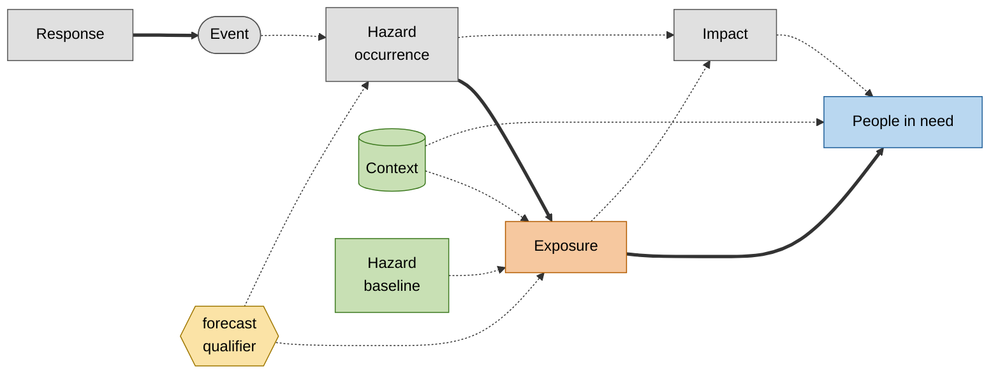

# Risk Model Options: Ontology and Integration Levels

> **Status:** Proposal for discussion. It is not a decision. It answers the action from the core-partner
> call of 23 September 2026 in [discussion #110](https://github.com/IFRCGo/monty-stac-extension/discussions/110):
> "propose options for an updated data model, with diagrams".
> This document is about the **ontology**: the concepts, their definitions and their relations.
> It does not define schema fields. Schema work starts after the partners choose a level (§7).

## 1. The question

Discussion #110 started with two gaps in the impact model:

- **Forecast vs observed.** The partners agree on an item-level `monty:forecast` object (option 1b).
- **Exposure vs impact.** The partners agree that exposure is not impact, and that exposure goes in separate collections (option 2c).

The core-partner calls of 9 and 23 September 2026 moved the question up one level:

- Can a hazard exist **without an event**? If yes, Montandon collects data outside of an event.
- The partners prefer the **INFORM** concepts: Hazard & Exposure, Vulnerability, Lack of coping capacity.
- The north star is to **estimate people in need** for forecast, imminent and recent events.

This document gives the concepts (§2–§4), the ontology (§5), and a ladder of **integration levels** (§7).
The partners choose a target level on the ladder.

## 2. Two meanings of "hazard"

The word "hazard" has two meanings. The question "can a hazard exist without an event?" mixes them.

| | Hazard **occurrence** | **Baseline** hazard |
|---|---|---|
| Example | Cyclone NOUL-26 track, 26 July 2026 | 1-in-100-year flood depth map of Nepal |
| Time | A date, or a forecast valid time | No occurrence time. A return period or an annual probability |
| Becomes an event? | Yes, or it is one already | Never. It is a statistic over many possible events |
| Sources | GDACS, USGS, PDC, IBTrACS | JRC flood hazard maps, GEM seismic hazard, GIRI |
| In Montandon today | Yes | No |

Thus there are two cases of "hazard without an event":

- **Case A — a pre-event occurrence.** A forecast track exists, but nobody has declared an event yet.
  It becomes an event, or it dissipates.
- **Case B — a baseline hazard.** It describes a place, not an occurrence. It never becomes an event.

Both cases are a **Hazard without an event**. A qualifier must tell a baseline hazard from an
occurrence. Without it, a 100-year flood map is counted in a query such as "hazards in Nepal in 2026".

## 3. A risk function with an open signature

The UNDRR defines disaster risk as the potential loss "determined probabilistically as a function of
hazard, exposure, vulnerability and capacity"
([UNDRR terminology](https://www.undrr.org/terminology/disaster-risk)). We write it as a function with
an **open signature**:

```text
Risk = f(Hazard, Exposure, [Vulnerability], [Capacity], ...)
```

Hazard and exposure are always present. The other arguments are optional. Each framework is **one
implementation** of `f`. Each one selects its arguments and draws its own boundaries between them:

| Implementation of `f` | Arguments | How it partitions |
|---|---|---|
| UNDRR | hazard, exposure, vulnerability, capacity | four terms |
| INFORM Risk | (hazard & exposure), vulnerability, lack of coping capacity | hazard and exposure in one dimension; social vulnerability |
| IPCC AR5 | hazard, exposure, vulnerability | vulnerability includes "lack of capacity to cope and adapt" |
| Loss models (RDLS, GEM) | hazard, exposure, fragility | physical vulnerability (damage curves) |
| Rapid people-in-need estimate (§4) | hazard footprint, exposed population, vulnerability factor | per admin unit |

**Consequence for Montandon:** Montandon stores the **arguments**. The analysis selects `f`.
This matches the position from the 23 September call: analytical frameworks belong to specialised
processors, and Montandon collects, structures and documents the source data.

A dataset that one framework calls "vulnerability" and another calls "coping capacity" is then a
value to discuss. It is not a change of the model.

## 4. The key test, and what people in need requires

### 4.1 Is the data tied to a hazard?

Use this test: **if the hazard footprint changes, does the number change?**

| Figure | Tied to a hazard? | Concept |
|---|---|---|
| 103 M people in the 39 kt wind field (GDACS `pop39`) | Yes | Exposure |
| 12 hospitals in the flood extent | Yes | Exposure |
| 1200 deaths reported | Yes | Impact |
| WorldPop population grid of Nepal | No | Context (§5.2) |
| 40 % of a district below the poverty line | No | Context — vulnerability |
| 0.3 physicians per 1000 people | No | Context — coping capacity |
| Admin boundaries (CODs) | No | Context |

**Exposure is where the two kinds of data meet:**
`Exposure = hazard footprint ∩ population or assets`.

Exposed elements are people **and** assets: buildings, infrastructure (roads, bridges, hospitals, schools,
ports, airports, power plants), crops and livestock. The Montandon
["Exposure Category" taxonomy](taxonomy.md#exposure-category) already lists them. A people-in-need
estimate uses only the people part of the exposure.
This is why INFORM puts "Hazard & Exposure" in one dimension. It is also why the 23 September
call noted that "the exposure and hazard link is pretty obvious".

### 4.2 How people in need is estimated

The humanitarian chain is: total population → exposed → affected → **in need** → targeted → reached.

There are two families of method:

| | Assessment-based | Rapid, model-based |
|---|---|---|
| Used by | OCHA HNO, JIAF 2.0 | Anticipatory action, DREF, first 72 hours |
| When | Weeks after the event | Before the event (forecast) or in the first days |
| Method | Severity per area and population group, from needs assessments | Exposure per intensity band, multiplied by a vulnerability factor |
| Role of Montandon | Very small (field survey data) | **This is the Montandon case** |

A simple form of the rapid method, per admin unit:

```text
PIN(admin) = sum over intensity bands b of
             exposed_population(admin, b) × p_need(b, vulnerability(admin))
```

| Input | Concept | In Montandon today? |
|---|---|---|
| Hazard footprint with intensity bands | Hazard | Yes |
| Exposed population per band | Exposure | Partly (GDACS, filed as impact) |
| Population grid, vulnerability, admin boundaries | Context | No |
| Past impacts, to calibrate `p_need` | Impact | **Yes** — the impact archive is a strong asset |

**Consequence:** a people-in-need estimate needs exposure at the time of the event **and**
vulnerability data that exists before the event. An event-only Montandon gives the first input and
the calibration data. It does not give the second input.

## 5. The ontology

### 5.1 Concepts and relations



- **Thick arrow = mandatory:** every instance of the source concept must have this relation.
  **Dashed arrow = optional.**
- Mandatory relations: a Response addresses an Event; an Exposure is always the footprint of a Hazard;
  a People-in-need estimate always uses an Exposure. All other relations are optional.
- **Relations are links.** Two linked concepts do not share a data model.
- **Forecast is a qualifier, not a concept.** It applies to Hazard, Exposure, Impact and People in need.
  It carries an issue time and a valid time (`monty:forecast`, #110 option 1b).
- **Context has no stored link** to an event or a hazard. It is found at query time, by location or by country.

### 5.2 Context: data that is not tied to a hazard

Population grids, poverty indices, coping indicators and admin boundaries are not tied to a hazard.
Montandon calls this concept **Context**: the conditions of a place or a population that do not depend
on a hazard.

The term comes from the JIAF 2.0 pillar "Context": the political, socio-cultural, economic, demographic,
security and infrastructure characteristics of the area. Humanitarian analysts know it, and it does not
belong to one risk framework.

Context is a **main** input of a people-in-need estimate (§4.2). It is not secondary data.

**"Context" is not an INFORM term.** INFORM Risk puts this data in two dimensions: *Vulnerability* and
*Lack of coping capacity*. INFORM Severity uses three dimensions: *Impact of the crisis*, *Conditions of
affected people*, *Complexity of the crisis*. The glossary (§6) shows the INFORM terms next to Context.

### 5.3 Vulnerability and coping capacity: concepts, or kinds of Context?

If Context holds population, poverty and coping indicators, two answers are possible:

- **Kinds of Context.** Vulnerability and coping capacity are categories of Context data.
  - For: fewer concepts. The partition of each framework (§3) becomes a category value.
  - Against: they are less visible than Hazard and Exposure.
- **Concepts of their own.** Vulnerability and Coping capacity are at the same level as Hazard and Exposure.
  - For: this matches the INFORM picture that the partners prefer.
  - Against: a dataset on the boundary (for example health access) forces a choice that another framework does not make.

In both answers, the glossary gives Vulnerability and Coping capacity one precise definition each.

## 6. Glossary and crosswalk

### 6.1 Montandon terms next to other frameworks

| Montandon term | Definition (draft) | UNDRR | INFORM | JIAF 2.0 | RDLS | IPCC AR5 |
|---|---|---|---|---|---|---|
| Event | A real-world disaster occurrence, observed or forecast, as reported by a source | hazardous event, disaster | crisis (Severity) | shock | event | — |
| Hazard, occurrence | A hazard process at a given time and place, with an intensity. Observed or forecast | hazardous event | Natural, Human hazard | shock | hazard footprint | hazard |
| Hazard, baseline | The probability or return period of a hazard intensity at a place. No occurrence time | hazard | Hazard & Exposure (hazard part) | — | hazard | hazard |
| Exposure | People or assets inside a hazard area, for an intensity threshold | exposure | Hazard & Exposure (exposure part) | — | exposure | exposure |
| Context | Conditions of a place or a population that do not depend on a hazard | — | Vulnerability; Lack of coping capacity | context | exposure (baseline) | — |
| Vulnerability | Social and economic conditions of a population that increase the harm | vulnerability | Vulnerability | context; humanitarian conditions (in part) | vulnerability (**physical**) | vulnerability (includes lack of coping capacity) |
| Coping capacity | Ability of institutions and infrastructure to absorb the shock | capacity, coping capacity | Lack of coping capacity (inverse) | humanitarian conditions: coping mechanisms (households) | — | inside vulnerability |
| Impact | Observed or estimated effect of a hazard on people or assets | disaster impact, loss | Impact of the crisis (Severity) | impact | loss | impact |
| People in need | Estimated number of people who need assistance | — | Conditions of affected people (Severity) | humanitarian conditions → people in need | — | — |
| Response | An action taken, or a product made, in response to an event | response | — | — | — | — |
| Forecast (qualifier) | A figure about a future valid time, with an issue time | early warning | INFORM Warning (in development) | forecast needs | analysis type | projection |

Two traps:

1. **Social or physical vulnerability?** INFORM means social vulnerability: indices per country or admin
   unit. RDLS and engineering mean physical vulnerability: damage curves per building type. The proposed
   Montandon meaning is **social**. Physical vulnerability is out of scope for now.
2. **Past impacts can be an input to vulnerability.** INFORM uses "recent shocks" as a vulnerability
   indicator. The Montandon impact records can feed such an indicator. They stay Impact records.

### 6.2 Montandon terms in the STAC collections

This table shows **where** each concept lives in STAC, and **how** it links. It does not define fields.
Names in *italics* are working names.

| Term | Level (§7) | STAC role | Collections | Detail object | `monty:hazard_codes` | Time |
|---|---|---|---|---|---|---|
| Event | 0 | `event` + `source` or `reference` | `<source>-events` | — | required | occurrence |
| Hazard, occurrence | 0 | `hazard` | `<source>-hazards` | `monty:hazard_detail` | required | occurrence; `monty:forecast` if forecast |
| Hazard, baseline | 4 | `hazard` | `<dataset>-hazards` | `monty:hazard_detail` + *baseline qualifier* | required | validity period |
| Exposure | 1 | *`exposure`* | `<source>-exposure` | *`monty:exposure_detail`* | required | time of its hazard |
| Context | 4 | `context` | one per dataset, for example `worldpop-population`, `inform-risk` | *`monty:context_detail`*, + [product extension](https://github.com/stac-extensions/product) | **not required** | release or reference year |
| Vulnerability, Coping capacity | 4 | a category of Context, **or** their own roles (§5.3) | as Context | as Context | not required | as Context |
| Impact | 0 | `impact` | `<source>-impacts` | `monty:impact_detail` | required | period of the estimate |
| People in need | 3 | *`need`* | `<workflow>-need` | *to define* | required | time of the estimate; `monty:forecast` if before the event |
| Response | 0 | `response` | `<source>-response` | `monty:response_detail` | required | publication or action window |
| Forecast | 2 | — (qualifier) | — | `monty:forecast` | — | issue time, valid time |

| Relation | Meaning | Carried by | Level |
|---|---|---|---|
| Hazard → Event | the occurrence belongs to the event | `related` link with `roles: ["event"]`; query-time correlation for pre-event items (§8.1) | 0, 2 |
| Exposure → Hazard | exposure to this footprint and threshold | `related` link with `roles: ["hazard"]`, **required** | 1 |
| Exposure → Context | the population or asset data used to compute the exposure | `derived_from` link | 1, 4 |
| Impact → Hazard | effect of this hazard | `related` link with `roles: ["hazard"]` | 0 |
| Impact → Response | figure taken from a response product | `derived_from` link | 0 |
| People in need → inputs | exposure, context and impacts used, with their versions | `derived_from` links (external URL if the input is not in Montandon) | 3 |
| Context ↔ Hazard, Event | the context of a place | **no stored link**: query by location or `monty:country_codes` | 4 |
| Response → Event, Hazard | what the response addresses | as today ([Response](README.md#response)) | 0 |

## 7. Levels of integration

The options are a **ladder**. Each level adds concepts to Montandon. The partners choose a **target level**
and a path to it. The levels are mostly cumulative. Level 3 can come without level 2.

| Level | Montandon holds | What it adds | Rules relaxed | New pipelines | People-in-need support | Main risk |
|---|---|---|---|---|---|---|
| **0 — Today** | Events, hazards, impacts, responses | — (exposure filed as impact, `potentially_affected`) | — | — | Low | Exposure read as impact (credibility) |
| **1 — Event-linked exposure** | + Exposure for event occurrences | Exposure separate from impact | None | Migrate GDACS, CEMS, USGS PAGER | Exposure available | Small |
| **2 — Pre-event occurrences** | + forecast hazards and exposure before an event exists | Anticipatory action | "A hazard is always linked to an event" (forecasts) | Forecast feeds (GDACS, PDC) | Early exposure | Links only at query time |
| **3 — Analytical results** | + people-in-need estimates, linked to their inputs and versions | North-star figure in the catalogue | None | Write-back from notebooks (open decision, 16 September call) | Result stored | Montandon publishes a people-in-need figure: accountability |
| **4 — Context catalogue** | + Context (population, vulnerability, coping, boundaries) + baseline hazards | Preparedness with no active event | "A hazard is always linked to an event" (baseline hazards); `monty:hazard_codes` required (not for Context) | Yearly harvests (INFORM, WorldPop, CODs, hazard maps) | All inputs in one place | Scope change; duplicate of INFORM, HDX, RDL catalogues; drift to IFRC-specific needs |



Colours: grey = level 0, orange = level 1, yellow = level 2, blue = level 3, green = level 4.
Thick arrow = mandatory relation. Dashed arrow = optional relation (see §5.1).

### 7.1 The arguments, per level

**Level 1** closes the credibility gap raised in #110: 103 million people in a wind field must not read
as 103 million people affected. It changes no rule. It is a precondition for every higher level.

**Level 2** supports anticipatory action. The data keeps its current shape (occurrences). The cost is
forecasts that never become events. They stay as items with no event, and a client finds related events
at query time (§8.1).

**Level 3** puts the north-star figure in the catalogue, but Montandon does not harvest the baselines.
The inputs stay external and are cited with their versions. The cost is accountability. A people-in-need
figure published by Montandon will be used as an official figure.

**Level 4** gives all the inputs in one catalogue, and supports preparedness when no event is active.
It is the largest change of scope. Montandon has historically focused on event data. Each new dataset
adds quality work, and the event list itself is not complete yet. INFORM, HDX and the Risk Data Library
already publish many of these datasets.

## 8. Supporting choices

### 8.1 Pre-event items: link at query time

A pre-event item does not store a link to an event. The
[dynamic correlation](stac-api/correlation_algorithms.md) finds related items at query time
(hazard codes, countries, time, and optionally location).

- One forecast can match several events (for example one event per country). This is the reality. It is not
  an error. A client that wants one best match needs a ranking.
- The result depends on the correlation rules. Thus the correlation query must be **named and versioned**,
  and an analysis must record the version that it used.

### 8.2 Context datasets in STAC

A Context dataset is a **dataset**, not a stream of records. It is one item per dataset release (or per
country, if the dataset is large), with raster (COG) or table (Parquet) assets. It is not one item per
indicator and per admin unit.

The [product extension](https://github.com/stac-extensions/product) can describe the product family
(`product:type`) and the release cadence (`product:timeliness`, for example `P1Y` for a yearly release).
It describes packaging and distribution, not meaning. Its maturity is "Proposal".
`product:status` overlaps `monty:response_detail.status`. Do not use it before this overlap has a rule.

## 9. Worked examples

### 9.1 Cyclone NOUL-26 up the ladder

GDACS event 1001294, episode 13 ([#110](https://github.com/IFRCGo/monty-stac-extension/discussions/110)).

| Level | What Montandon holds for NOUL-26 |
|---|---|
| 0 | Event and hazard items. `pop39` = 103 014 755 filed as an impact, type `potentially_affected` |
| 1 | `pop39` and `pop74` become **Exposure** items. Each one links to the hazard item and states its wind threshold (39 kt, 74 kt). The impact collection holds only effects |
| 2 | The forecast track positions (advisory 13, `actual: False`) are hazard items with `monty:forecast` (issue time 26 Jul 00:00, valid time 27 Jul 00:00). Their exposure items exist before any event is declared |
| 3 | A notebook combines the exposure per wind band with district vulnerability, and writes a people-in-need estimate per district. The item links to the exposure items and to the vulnerability dataset release that it used |
| 4 | The population grid and the district vulnerability dataset are Context items in Montandon. The notebook finds them by location |

### 9.2 Earthquake in the Southern Tibetan Plateau up the ladder

USGS event `us6000pi9w`: M 7.1, Dingri County, 7 January 2025. PAGER alert: red for economic losses,
orange for fatalities. The repository already has its [event](https://github.com/IFRCGo/monty-stac-extension/blob/main/examples/usgs-events/us6000pi9w.json),
[ShakeMap hazard](https://github.com/IFRCGo/monty-stac-extension/blob/main/examples/usgs-hazards/us6000pi9w-shakemap.json) and
[PAGER impact](https://github.com/IFRCGo/monty-stac-extension/blob/main/examples/usgs-impacts/us6000pi9w-fatalities.json) items.

PAGER population exposure by shaking intensity (MMI), from `json/exposures.json`:

| Country | MMI IV (light) | MMI V | MMI VI | MMI VII | MMI VIII | MMI IX (violent) |
|---|---:|---:|---:|---:|---:|---:|
| China | 611 107 | 145 506 | 61 485 | 27 679 | 6 964 | 2 998 |
| Nepal | 19 339 548 | 1 942 | 0 | 0 | 0 | 0 |
| India | 96 979 504 | 4 | 0 | 0 | 0 | 0 |
| Bangladesh | 13 802 713 | 0 | 0 | 0 | 0 | 0 |
| All countries | 130 864 619 | 147 452 | 61 485 | 27 679 | 6 964 | 2 998 |

| Level | What Montandon holds for the earthquake |
|---|---|
| 0 | Event, ShakeMap hazard, and two PAGER impact items: 858 fatalities and USD 1 billion of losses, both `modelled`. `exposures.json` is only an asset. It is not mapped |
| 1 | One **Exposure** item per country and MMI level, linked to the ShakeMap hazard. The 130.9 million people at MMI IV felt light shaking. They were not harmed. As an exposure, this figure cannot be read as an impact. The reported toll (126 deaths, Chinese authorities) and the PAGER estimate (858) are both Impact items. Their provenance is different (`primary` vs `modelled`) |
| 2 | **Not applicable.** An earthquake is not forecast. This is why level 2 is optional: for some hazard types, it adds nothing |
| 3 | A people-in-need estimate uses the exposure at MMI VI and above. Here the main vulnerability factor is **physical**: PAGER notes that most people live in "adobe block and unreinforced brick" buildings. Social vulnerability (§6.1) is a second factor |
| 4 | Context holds the population grid and building-stock data for the region. A seismic hazard map of the Himalaya (GEM) is a **baseline hazard**: a hazard without an event. INFORM has no subnational model for Nepal (§11) |

What this example adds to NOUL-26:

- **Level 2 depends on the hazard type.** Cyclones and floods have forecasts. Earthquakes do not.
- **Exposure crosses borders.** The event is in China, but most of the exposed people are in India and Nepal.
  Exposure items per country make this visible.
- **Physical vulnerability matters.** For earthquakes, building type drives the harm. The decision to use
  only social vulnerability (§6.1, question 3) must consider this case.
- **Secondary hazards.** PAGER reports landslides and liquefaction. They are concurrent hazards of the same event.

## 10. Questions for the partners

1. What is the **target level**, and what is the path to it?
2. Are Vulnerability and Coping capacity concepts of their own, or kinds of Context (§5.3)?
3. Do we agree that Vulnerability means **social** vulnerability in Montandon (§6.1)?
4. For level 3: who is accountable for a people-in-need figure that Montandon publishes?
5. For level 4: which Context datasets are necessary for the use cases? Which ones must stay with their
   publishers (INFORM, HDX, RDL)?

## 11. Facts checked, and open points

| Fact | Status |
|---|---|
| UNDRR disaster risk: "function of hazard, exposure, vulnerability and capacity" | Checked ([UNDRR](https://www.undrr.org/terminology/disaster-risk)) |
| IPCC AR5 vulnerability includes "lack of capacity to cope and adapt" | Checked (IPCC WGII AR5 glossary) |
| JIAF 2.0 pillar "Context" covers demographic, socio-economic, infrastructure characteristics | Checked ([IASC JIAF 2.0](https://interagencystandingcommittee.org/operational-policy-and-advocacy-group/iasc-technical-manual-joint-and-intersectoral-analysis-framework-jiaf-20)) |
| JIAF 2.0: exact name of the fifth pillar (current and forecast priority needs) | **To verify** in the JIAF technical manual |
| INFORM Severity dimensions: impact, conditions of affected people, complexity | Checked ([ACAPS](https://www.acaps.org/en/thematics/all-topics/inform-severity-index)) |
| INFORM Warning is in development | Checked ([DRMKC](https://drmkc.jrc.ec.europa.eu/inform-index)) |
| INFORM subnational models: Bangladesh and Myanmar exist; **no model for Nepal** | Checked ([DRMKC](https://drmkc.jrc.ec.europa.eu/inform-index/INFORM-Subnational-Risk)). Important for the Nepal use case |
| The MapAction method for Use Case 1 follows the rapid form of §4.2 | **To verify** with MapAction |
| Earthquake `us6000pi9w`: PAGER exposure per MMI, alert levels, building-type comment | Checked (USGS PAGER `exposures.json`, `alerts.json`, `comments.json`, read 25 September 2026) |
| Earthquake `us6000pi9w`: reported toll of 126 deaths | Checked (Chinese state media, 7 January 2025). Other sources report higher figures |

## References

- [Discussion #110](https://github.com/IFRCGo/monty-stac-extension/discussions/110) — two gaps in the impact model
- [Montandon model overview](README.md)
- [Response ↔ Impact Boundary Rules](response-impact-boundary.md)
- [STAC-based correlation algorithms](stac-api/correlation_algorithms.md)
- [INFORM](https://drmkc.jrc.ec.europa.eu/inform-index) — Risk, Severity, Warning, subnational models
- [Risk Data Library Standard](https://docs.riskdatalibrary.org/)
- [UNDRR terminology](https://www.undrr.org/terminology)
- [STAC product extension](https://github.com/stac-extensions/product)
