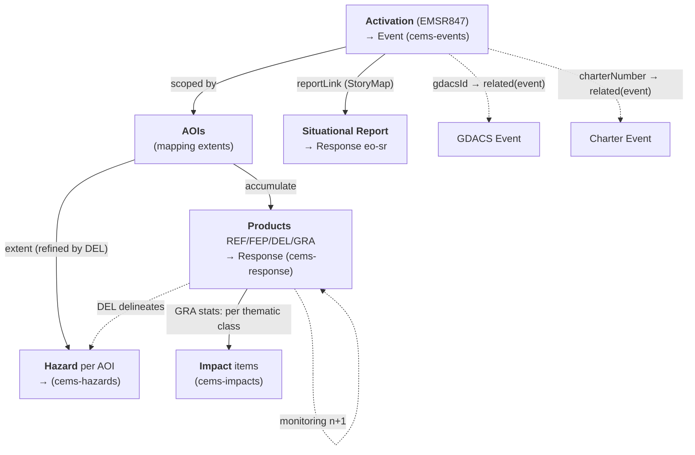

# Copernicus Emergency Management Service — Rapid Mapping

Copernicus EMS **Rapid Mapping (RM)** produces on-demand geospatial crisis
information — reference maps, delineations, and damage grading — for disasters
worldwide. Unlike the International Charter, CEMS exposes a **public JSON REST
API** (no STAC, no auth), so the ETL builds Monty STAC items directly from the API
payload. This document maps the CEMS RM object model to Monty STAC items.

> Scope: **Rapid Mapping only.** Risk & Recovery Mapping and EFFIS are out of scope
> (separate follow-ons). This is the WP1 data-model/ETL mapping; the RSS
> alert/listener (WP2 event-driven orchestration) is out of scope here.

## Collections

| Collection | Code | Monty role | Source for |
|------------|------|------------|------------|
| Copernicus EMS RM — Events | `cems-events` | `event` | Activation |
| Copernicus EMS RM — Hazards | `cems-hazards` | `hazard` | Area of Interest (extent refined by the DEL delineation) |
| Copernicus EMS RM — Response | `cems-response` | `response` | Product (REF / FEP / DEL / GRA) + Situational Report |
| Copernicus EMS RM — Impacts | `cems-impacts` | `impact` | GRA product damage/exposure statistics |

- **Source organisation**: Copernicus Emergency Management Service (`CEMS`)
- **Source URL**: <https://mapping.emergency.copernicus.eu/>
- **API entry point**: <https://rapidmapping.emergency.copernicus.eu/backend/dashboard-api/> (public, no auth)
- **License**: Copernicus data policy — free & open; attribution *"© European Union, Copernicus Emergency Management Service"*
- **Temporal coverage**: 2012 onwards (EMSR activation series); 224 RM activations as of 2026-07

> **No CEMS STAC extension exists.** Per the [response taxonomy](../../response-taxonomy.md)
> and [best practices](../../response-best-practices.md), CEMS-specific fields are
> carried under `monty:response_detail` (there is no `cems:` extension). Response
> items declare `monty` (+ `processing` recommended); source-imagery extensions
> (`sat:` / `eo:` / `sar:`) live on the linked **acquisition** items, not on the
> Response product — except where a raw dataset is the deliverable (not the CEMS case).

## Object model

### The activation → product flow

A CEMS **Activation** (code `EMSR{n}`, e.g. `EMSR847`) is opened for a disaster and
scoped by one or more **Areas of Interest (AOIs)**. Each AOI accumulates **Products**
through the Rapid Mapping lifecycle, and each product may be re-issued as timed
**monitoring** iterations:

```
REF (reference) → FEP (first estimate) → DEL (delineation) → GRA (grading)
                                            └─ monitoring 1, 2, … (same type, monitoringNumber++)
```

A **Situational Report (SR)** is an ArcGIS **StoryMap** published at activation level
(`reportLink`) — a produced report, not a per-AOI geospatial product.



### Object mapping

| CEMS object | Monty type | Monty `id` pattern | Collection |
|-------------|------------|--------------------|------------|
| Activation | Event | `cems-event-{code}` (e.g. `cems-event-EMSR847`) | `cems-events` |
| Area of Interest (AOI) | Hazard | `cems-hazard-{code}-aoi{n}-{type}` | `cems-hazards` |
| Product (REF/FEP/DEL/GRA) | Response | `cems-response-{code}-aoi{n}-{type}[-m{k}]` | `cems-response` |
| Situational Report (`reportLink`) | Response (`eo-sr`) | `cems-response-{code}-sr` | `cems-response` |
| GRA statistic (per thematic class) | Impact | `cems-impact-{code}-aoi{n}-gra-{thematic}[-m{k}]` | `cems-impacts` |

- `{code}` is the activation code (`EMSR847`); `{n}` is the AOI `number`; `{type}` ∈
  `ref`/`fep`/`del`/`gra` (or the hazard type slug for `cems-hazards`); `-m{k}` is
  appended only for monitoring iterations (`monitoringNumber > 0`).
- **The AOI is the hazard-area entity** — the direct analog of a Charter Area — so it
  maps to a **Hazard** item (one per AOI, split per hazard code for multi-hazard
  activations, as Charter does). Geometry is the AOI `extent`, **refined to the DEL
  delineation polygon** when a Delineation product exists for that AOI (the DEL *is* the
  mapped hazard footprint). Hazard type/codes come from the activation `category`.
- The DEL product therefore has a **dual role**: it is both the `eo-del` **Response**
  (the deliverable) and the source of the **Hazard** geometry — the two items share
  `monty:corr_id` and cross-link (`related`).

## Data access

The **detail endpoint is the ETL unit** — one call returns the activation, its AOIs,
and every product (with images, stats, layers, downloads):

```bash
# Rich activation detail (ETL entry point) — returns {count,next,previous,results:[{…}]}
https://rapidmapping.emergency.copernicus.eu/backend/dashboard-api/public-activations/?code=EMSR847

# Activation list (discovery) — DRF pagination: ?limit=&offset= ; 224 RM activations
https://rapidmapping.emergency.copernicus.eu/backend/dashboard-api/public-activations-info/?limit=50
```

> [!IMPORTANT]
> - Public, no authentication; no rate limit observed during exploration.
> - The unified `mapping.emergency.copernicus.eu/activations/api/activations/` list has a
>   **different shape** (`category` is an object `{slug,name}`, adds `drmPhase`) and mixes
>   RM + Risk&Recovery — use the `rapidmapping` dashboard endpoints for RM ETL.
> - Assets live under `aws_bucket` / `productsPath`; per-product `downloadPath` (ZIP) and
>   `layers[]` (COG) give the deliverables; `images[].fileName` names the source imagery.

Reference fixtures in [`api-files/`](./api-files): `EMSR847` (storm; cross-source),
`EMSR871` (flood; has FEP), `EMSR842` (wildfire; minimal), and list samples.

## Activation → Event

Maps to a Monty Event item (`cems-events`); Monty extension only.

| CEMS field (activation) | Monty field | Notes |
|-------------------------|-------------|-------|
| `code` (`EMSR847`) | `id` (`cems-event-EMSR847`) | Prefix `cems-event-` |
| — | `collection: "cems-events"` | Required |
| `eventTime` | `datetime` / `start_datetime` | **Event onset** (not `activationTime`, which is when CEMS was tasked) |
| `name` | `title` | Direct copy |
| `reason` | `description` | Free-text situation summary |
| `centroid` (WKT POINT) | `geometry` | Parse WKT → GeoJSON Point; `extent` (WKT POLYGON) → `bbox` |
| `category` (+ `subCategory`) | `monty:hazard_codes` | Map via [Hazard codes](#hazard-codes) |
| `countries[].name` | `monty:country_codes` | Map country name → ISO 3166-1 alpha-3 |
| derived | `monty:corr_id` | Standard Monty algorithm (date/ISO3/spatial block/hazard/episode) — **not** the EMSR code |
| `gdacsId`, `charterNumber` | `links[rel=related]` | See [Cross-source linkage](#cross-source-linkage) |
| `reportLink`, source page | `links[rel=via]` | Activation page / StoryMap |

## Area of Interest → Hazard

Each AOI maps to a Monty Hazard item (`cems-hazards`); Monty extension only. This
mirrors the Charter Area→Hazard mapping.

| CEMS field (AOI / activation) | Monty field | Notes |
|-------------------------------|-------------|-------|
| `number` | `id` | `cems-hazard-{code}-aoi{n}-{type}` |
| — | `collection: "cems-hazards"` | Required |
| DEL product `extent` → else AOI `extent` (WKT) | `geometry` | **Prefer the Delineation polygon** (actual hazard footprint); fall back to the AOI extent |
| `name` | `title` | AOI name (e.g. `Kingston`) |
| activation `category` (+ `subCategory`) | `monty:hazard_codes` | **One code set per item** — split multi-hazard as Charter does; see [Hazard codes](#hazard-codes) |
| activation `countries` | `monty:country_codes` | Inherited from the activation |
| activation `eventTime` | `datetime` | Inherited from the activation |
| activation `max_extent` stat (if present) | `monty:hazard_detail.severity_value` | Optional; `severity_unit` per the stat (e.g. `km2`). CEMS AOIs carry no explicit severity otherwise |
| parent activation | `links[rel=derived_from]` | `../cems-events/cems-event-{code}.json` |
| DEL Response for this AOI | `links[rel=related]` (`roles: ["response"]`) | The delineation product the geometry came from |

> One Hazard per AOI **per hazard code** (Charter precedent): for a multi-hazard
> activation, emit one item per `monty:hazard_codes` set, same geometry. Single-category
> activations (the common case) yield one Hazard per AOI.

### Identifying multi-hazard

A CEMS activation carries a **single** `category` + `subCategory`, and **DEL products carry
no hazard-type field** — so *multiple delineation products do **not** signal multiple hazards*
(several DELs in an AOI are **monitoring iterations** of the same mapping). Multi-hazard is
identified from two other signals:

1. **`category` + `subCategory`** — the primary hazard (e.g. `Storm` / `Tropical cyclone`).
2. **GRA/GRM `stats` hazard-footprint classes** — thematic classes that name a *phenomenon*
   rather than an exposed asset reveal secondary hazards. Observed footprint classes:
   `Flooded area`, `Flood trace`, `Landslide`, `Burnt area` (e.g. a `Landslide` class inside a
   `Storm` activation ⇒ a secondary landslide hazard). `Maximum of all extents` and `NA` are
   aggregates, not hazards.

Emit one Hazard item per distinct hazard code so identified. The primary hazard takes its
geometry from the DEL delineation (§ above); a secondary hazard surfaced only via a GRA
footprint class takes its geometry from that class's extent where available, else the AOI
extent, and its severity from the class figure. Do **not** infer hazard multiplicity from the
DEL count.

## Product → Response

Each product maps to a Monty Response item via `monty:response_detail`.

| CEMS field (product) | Monty field | Notes |
|----------------------|-------------|-------|
| `type` | `monty:response_detail.type` | `REF`→`eo-ref`, `FEP`→`eo-fep`, `DEL`→`eo-del`, `GRA`→`eo-gra`. Monitoring/variant type codes (e.g. **`GRM`** grading-monitoring) map to their base product code (`eo-gra`) with `monitoring_number` set |
| `code` (activation) | `monty:response_detail.source_id` | e.g. `EMSR847` (source-system anchor) |
| `version.statusCode` | `monty:response_detail.status` | `F` (delivered)→`published`; `I` (in production)→`in-production`; `W` (scheduled, future `expectedDelivery`)→`planned`; `N` (not produced)→`withdrawn`, or `no-impact` when `version.reason` indicates no damage/impact. `feasible=false` → `withdrawn` |
| `monitoring` / `monitoringNumber` | `monty:response_detail.monitoring_number` | Set **only** when `monitoring=true`; iteration links to the prior via `rel: prev` |
| `extent` (WKT) | `geometry` / `bbox` | Product footprint (AOI extent) |
| — | `monty:response_detail.producer` | `Copernicus EMS` (mapping provider) |
| — | `monty:response_detail.methodology` | `human_interpreted` (RM is expert-produced) |
| — | `monty:response_detail.sendai_targets` | Taxonomy default for the type code |
| `images[]` | `links[rel=derived_from]` → acquisition item(s) | Source imagery (`sensorType`, `sensorName`, `resolutionClass`, `acquisitionTime`) carries `sat:`/`eo:`/`sar:` on the acquisition, **not** on the Response |
| `layers[]` (COG), `downloadPath` (ZIP) | `assets` | Web layers + downloadable package |

**Situational Report** → one Response per activation, `type = eo-sr`, whose asset is the
`reportLink` StoryMap URL (no geospatial payload).

A **DEL** Response additionally carries a `rel: related` (`roles: ["hazard"]`) link to the
`cems-hazards` item whose geometry it supplied (reciprocal of the Hazard→DEL link above).
Every Response links to its Event and Hazard(s) via `related`, sharing `monty:corr_id`.

> **Do not** put damage/exposure statistics in `monty:response_detail` — those become
> separate **Impact** items (below). **Do not** set `status` from anything but
> `version.statusCode`.

## GRA statistics → Impact

Only **GRA** products carry `stats`, shaped as
`{thematic_class: {sub_class: {unit, total, affected}}}`, e.g.:

```json
{ "Estimated population": { "None": { "total": 84000 } },
  "Built-up [No.]":       { "None": { "affected": 48253 } } }
```

Not every thematic class is an Impact. **Split the classes by kind first:**

- **Exposure / effect classes → Impact items** (one each): `Estimated population`, `Built-up`,
  `Transportation`, `Land use`, `Facilities`, `Blocked road / interruption`, `Temporary camp`, …
- **Hazard-footprint classes → Hazard** (not Impact): `Flooded area`, `Flood trace`,
  `Landslide`, `Burnt area` — these describe the phenomenon extent; they feed the Hazard
  geometry/severity (see [Identifying multi-hazard](#identifying-multi-hazard)).
- **Aggregates → skip**: `Maximum of all extents`, `NA`.

Per the [Response ↔ Impact boundary rules](../../response-impact-boundary.md), for each
**exposure** class emit **one Impact item**:

- `monty:impact_detail`: `category`/`type` from the thematic class, `value` = `affected`
  (fallback `total`), `unit` from the key/`unit` (`[No.]`, `[ha]`, `[km]`), `estimate_type: "primary"`.
- Canonical edge: **`Impact → derived_from → Response`** (the GRA Response), `roles: ["response"]`.
- Both items share the Event's `monty:corr_id`.
- Guard the `"NA"` / missing `total` case (skip or emit without a numeric value per boundary rules).
- Aggregated activation-level `stats` are the sum over AOIs — prefer per-product GRA `stats`
  to avoid double counting; if only activation `stats` exist, emit Impacts at Event level.

## Tracking over time

A CEMS activation evolves while it is open (`closed=false`): products are scheduled, then
delivered, re-mapped as monitoring iterations, and occasionally corrected. Three distinct
mechanisms carry that evolution into Monty — do not conflate them.

1. **Idempotent upsert — status & geometry maturing (same item).** Item ids are
   **deterministic** (`cems-response-{code}-aoi{n}-{type}[-m{k}]`, etc.), so re-ingesting an
   activation **updates the same items in place**. A product moving `W`→`I`→`F` just flips
   `monty:response_detail.status` (`planned`→`in-production`→`published`); the Hazard geometry
   firms up when its DEL delineation is delivered. No new item per status change.

2. **Monitoring axis — a time series of items (`rel: prev`).** Each monitoring iteration is a
   **separate** product (own `id`, own `deliveryTime`, `monitoringNumber` 0,1,2…) → a separate
   Response item (`monty:response_detail.monitoring_number`) and separate derived Impact items.
   Chain iteration *n* to *n−1* with **`rel: prev`** within the same `(code, aoiNumber, type)`;
   set `datetime` from the product `version.deliveryTime` (or `images[].acquisitionTime`). This
   is the primary "track over time" mechanism — a growing, timestamped chain.

3. **Revision axis — corrections (`version.number`).** A product re-issued as a correction
   (`version.number` 1→2, e.g. *"Correction of the legend"*) supersedes the prior revision of
   the *same* monitoring product. The API exposes only the latest revision, so **replace in
   place** (optionally record the version via the STAC **Versioning** extension:
   `predecessor-version` / `latest-version`).

**Impact over time** therefore comes from the **per-product GRA** series (each GRA carries its
own `deliveryTime` + `monitoringNumber`), yielding one timestamped Impact item per exposure
class **per iteration**, chained by `rel: prev`. The aggregated activation `stats` is a rolling
snapshot with **no history** — use it only as a current-total cross-check or when per-product
stats are absent (never in addition, to avoid double counting).

**The join & refresh:** every item across both axes shares `monty:corr_id` — query by it and
order by `datetime` / `monitoring_number` to reconstruct the timeline. Detect change by
polling the **list endpoint's `lastUpdate`** per activation (the detail payload omits it) and
refetching detail when it advances; **`closed=true` ⇒ final** (stop polling), `closed=false` ⇒
live. (WP2 RSS feeds provide the same trigger event-driven.)

## Cross-source linkage

CEMS activations carry hard references to sibling sources. Beyond a shared
`monty:corr_id`, **derive the target Monty item id and emit an explicit `rel: related`
link** so the graph is directly navigable (65/224 sampled activations carry a `gdacsId`).

| CEMS field | Example | Target Monty id (derivation) | Link |
|------------|---------|------------------------------|------|
| `gdacsId` | `TC1001230` | GDACS `{eventtype}`+`{eventid}`; Monty id `{eventid}-{episodeid}` in `gdacs-events` → `1001230-{episode}` | `rel: related`, `roles: ["event"]` |
| `charterNumber` (+ `charterUrl`) | `996` | Charter Event `charter-event-{activation_id}` → `charter-event-996` (`charter-events`) | `rel: related`, `roles: ["event"]` (+ `["response"]` to Charter VAPs) |
| `relatedevents` | EMSR codes | `cems-event-{code}` | `rel: related`, `roles: ["event"]` |

This is a **reusable pattern**: any cross-reference field that yields a deterministic
source-item id becomes a typed `related` link, with `monty:corr_id` as the fallback join.
The edge is reciprocal — the Charter source doc already links VAPs to sibling Responses.
Open: GDACS episode resolution, and whether to emit links before the target is ingested
(see [Open decisions](#open-decisions)).

## Hazard codes

CEMS `category` (refined by `subCategory`) maps to Monty hazard codes. UNDRR-ISC 2025 is
required (exactly one per Hazard item); GLIDE and EM-DAT are recommended. The complete CEMS
category vocabulary (from the full activation catalogue, all DRM phases; **case-normalise** —
`Mass Movement`/`Mass movement`, `Industrial Accident`/`Industrial accident` occur in both
casings):

| CEMS `category` | UNDRR-ISC 2025 | GLIDE | EM-DAT | Notes / `subCategory` refinement |
|-----------------|----------------|-------|--------|----------------------------------|
| Flood | MH0600 | FL | nat-hyd-flo-flo | `Riverine flood`→MH0604, flash→MH0603, coastal/surge→MH0605 |
| Wildfire | MH1301 | WF | nat-cli-wil-for | `Forest fire`; land/other fire variants |
| Storm | MH0400 | ST | nat-met-sto | `Tropical cyclone, hurricane, typhoon`→MH0403 / `TC` / `nat-met-sto-tro` |
| Earthquake | GH0101 | EQ | nat-geo-ear-gro | `Ground shaking`; tsunami subCat→GH0301/`TS` |
| Mass Movement | MH0901 | LS | nat-geo-mmd-lan | Landslide; avalanche→MH1201, rockfall/subsidence per `subCategory` |
| Volcanic Activity | GH0201 | VO | nat-geo-vol | Eruption; ashfall/lahar per `subCategory` |
| Industrial Accident | TH0300 / TH0600 | — | tec-ind | Technological — chemical (TH0300) vs explosion (TH0600) vs oil spill from `subCategory`; manual review |
| Transport accident | — | — | tec-tra | Technological — no clean UNDRR-ISC; manual review |
| Humanitarian Crisis | — | CE | — | Complex/societal emergency — no UNDRR-ISC natural code; manual review (mostly Risk & Recovery, out of core RM scope) |
| Environmental Degradation | — | — | — | Environmental hazard — no clean UNDRR-ISC; manual review |
| Other | — | OT | — | Unclassified — manual review |

> **Completeness**: this table covers the full observed vocabulary (RM currently exercises
> Flood, Wildfire, Storm, Earthquake, Mass Movement, Industrial/Transport accident, Other;
> Volcanic Activity, Humanitarian Crisis, Environmental Degradation appear in the broader
> catalogue). Any **unmapped or new** `category` MUST fall through to manual review rather
> than be dropped. `subCategory` (detail endpoint only) is the refinement key.

Apply `hazard_profiles.get_canonical_hazard_codes()` after mapping.

## Reference files

Real upstream CEMS API responses, used as mapping fixtures:

- [`api-files/EMSR847-storm-detail.json`](./api-files/EMSR847-storm-detail.json) — Tropical Cyclone Melissa; 39 AOIs, 67 products, monitoring, carries `gdacsId` **and** `charterNumber`/`charterUrl`
- [`api-files/EMSR871-flood-detail.json`](./api-files/EMSR871-flood-detail.json) — flood; contains FEP + DEL + GRA
- [`api-files/EMSR842-wildfire-detail.json`](./api-files/EMSR842-wildfire-detail.json) — wildfire; minimal (2 GRA)
- [`api-files/rapidmapping-activations-list.json`](./api-files/rapidmapping-activations-list.json) — list endpoint (pagination)
- [`api-files/unified-activations-list.json`](./api-files/unified-activations-list.json) — unified endpoint (different shape)

See [`FINDINGS.md`](./FINDINGS.md) for the raw familiarisation notes (esa-montandon#20).

## Open decisions

1. **`statusCode` enum** — observed `F` (delivered), `I` (in production), `W` (scheduled),
   `N` (not produced), mapped to `published`/`in-production`/`planned`/`withdrawn`
   respectively. Confirm no further codes exist historically and pin the `N`→`withdrawn`
   vs `no-impact` rule (from `version.reason`).
2. **Hazard geometry & monitoring** — AOI → Hazard, geometry = DEL delineation when present,
   else AOI `extent`. Remaining: which DEL supplies the polygon (base vs **latest monitoring**
   — lean latest), and whether the Hazard geometry is **updated in place** as monitoring DELs
   arrive or versioned.
3. **Multi-hazard extent** — a secondary hazard identified from a GRA footprint class
   (`Landslide` in a `Storm` activation) has no dedicated polygon in the API; decide whether to
   reuse the AOI/DEL extent or leave geometry coarse.
4. **Response geometry** — per-AOI vs per-product `extent` for Response items (both present;
   products carry their own `extent`, generally the AOI extent).
5. **Source imagery** — emit linked acquisition items (from `images[]`, carrying
   `sat:`/`eo:`/`sar:`) via `derived_from`, or keep `images[]` as product metadata only.
6. **Cross-source links** — resolve GDACS episode; emit `related` links unconditionally
   (deterministic id) or only when the target is present in Montandon.

*Resolved in [Tracking over time](#tracking-over-time): monitoring lineage (`rel: prev`
per iteration), revision handling (`version.number` supersede), and Impact granularity
(per-product GRA series, not the aggregated snapshot).*

## Resources

- [CEMS Rapid Mapping portal](https://rapidmapping.emergency.copernicus.eu/)
- [Rapid Mapping product portfolio](https://mapping.emergency.copernicus.eu/about/rapid-mapping-portfolio/)
- [How to harvest CEMS Mapping data](https://mapping.emergency.copernicus.eu/about/how-to-harvest-cems-mapping-data/)
- [Response taxonomy](../../response-taxonomy.md) · [Response best practices](../../response-best-practices.md) · [Response ↔ Impact boundary](../../response-impact-boundary.md)
- [Monty STAC Extension specification](../../../../README.md)
