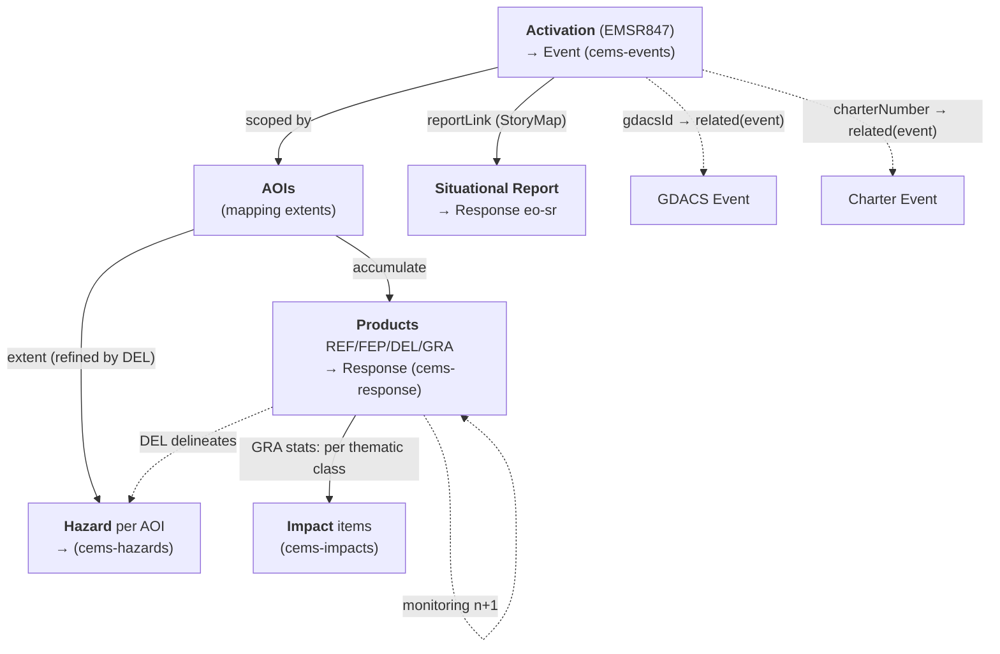

# Copernicus Emergency Management Service — Rapid Mapping

Copernicus EMS **Rapid Mapping (RM)** produces on-demand geospatial crisis
information — reference maps, delineations, and damage grading — for disasters
worldwide. Unlike the International Charter, CEMS exposes a **public JSON REST
API** (no STAC, no auth), so the ETL builds Monty STAC items directly from the API
payload. This document maps the CEMS RM object model to Monty STAC items.

> Scope: **Rapid Mapping only.** Risk & Recovery Mapping and EFFIS are out of scope
> (separate follow-ons). This is the WP1 data-model/ETL mapping; the RSS
> alert/listener (WP2 event-driven orchestration) is out of scope here.

## Collections

| Collection | Code | Monty role | Source for |
|------------|------|------------|------------|
| Copernicus EMS RM — Events | `cems-events` | `event` | Activation |
| Copernicus EMS RM — Hazards | `cems-hazards` | `hazard` | Area of Interest (extent refined by the DEL delineation) |
| Copernicus EMS RM — Response | `cems-response` | `response` | Product (REF / FEP / DEL / GRA) + Situational Report |
| Copernicus EMS RM — Impacts | `cems-impacts` | `impact` | GRA product damage/exposure statistics |

- **Source organisation**: Copernicus Emergency Management Service (`CEMS`)
- **Source URL**: <https://mapping.emergency.copernicus.eu/>
- **API entry point**: <https://rapidmapping.emergency.copernicus.eu/backend/dashboard-api/> (public, no auth)
- **License**: Copernicus data policy — free & open; attribution *"© European Union, Copernicus Emergency Management Service"*
- **Temporal coverage**: 2012 onwards (EMSR activation series); 224 RM activations as of 2026-07

> **No CEMS STAC extension exists.** Per the [response taxonomy](../../response-taxonomy.md)
> and [best practices](../../response-best-practices.md), CEMS-specific fields are
> carried under `monty:response_detail` (there is no `cems:` extension). Response
> items declare `monty` (+ `processing` recommended); source-imagery extensions
> (`sat:` / `eo:` / `sar:`) live on the linked **acquisition** items, not on the
> Response product — except where a raw dataset is the deliverable (not the CEMS case).

## Object model

### The activation → product flow

A CEMS **Activation** (code `EMSR{n}`, e.g. `EMSR847`) is opened for a disaster and
scoped by one or more **Areas of Interest (AOIs)**. Each AOI accumulates **Products**
through the Rapid Mapping lifecycle, and each product may be re-issued as timed
**monitoring** iterations:

```text
REF (reference) → FEP (first estimate) → DEL (delineation) → GRA (grading)
                                            └─ monitoring 1, 2, … (same type, monitoringNumber++)
```

A **Situational Report (SR)** is an ArcGIS **StoryMap** published at activation level
(`reportLink`) — a produced report, not a per-AOI geospatial product.



### Object mapping

| CEMS object | Monty type | Monty `id` pattern | Collection |
|-------------|------------|--------------------|------------|
| Activation | Event | `cems-event-{code}` (e.g. `cems-event-EMSR847`) | `cems-events` |
| Area of Interest (AOI) | Hazard | `cems-hazard-{code}-aoi{n}-{type}` | `cems-hazards` |
| Product (REF/FEP/DEL/GRA) | Response | `cems-response-{code}-aoi{n}-{type}[-m{k}]` | `cems-response` |
| Situational Report (`reportLink`) | Response (`eo-sr`) | `cems-response-{code}-sr` | `cems-response` |
| GRA statistic (per thematic class) | Impact | `cems-impact-{code}-aoi{n}-gra-{thematic}[-m{k}]` | `cems-impacts` |

- `{code}` is the activation code (`EMSR847`); `{n}` is the AOI `number`; `{type}` ∈
  `ref`/`fep`/`del`/`gra` (or the hazard type slug for `cems-hazards`); `-m{k}` is
  appended only for monitoring iterations (`monitoringNumber > 0`).
- **The AOI is the hazard-area entity** — the direct analog of a Charter Area — so it
  maps to a **Hazard** item (one per AOI, split per hazard code for multi-hazard
  activations, as Charter does). Geometry is the AOI `extent`, **refined to the DEL
  delineation polygon** when a Delineation product exists for that AOI (the DEL *is* the
  mapped hazard footprint). Hazard type/codes come from the activation `category`.
- The DEL product therefore has a **dual role**: it is both the `eo-del` **Response**
  (the deliverable) and the source of the **Hazard** geometry — the two items share
  `monty:corr_id` and cross-link (`related`).

## Data access

The **detail endpoint is the ETL unit** — one call returns the activation, its AOIs,
and every product (with images, stats, layers, downloads):

```bash
# Rich activation detail (ETL entry point) — returns {count,next,previous,results:[{…}]}
https://rapidmapping.emergency.copernicus.eu/backend/dashboard-api/public-activations/?code=EMSR847

# Activation list (discovery) — DRF pagination: ?limit=&offset= ; 224 RM activations
https://rapidmapping.emergency.copernicus.eu/backend/dashboard-api/public-activations-info/?limit=50
```

> [!IMPORTANT]
> - Public, no authentication; no rate limit observed during exploration.
> - The unified `mapping.emergency.copernicus.eu/activations/api/activations/` list has a
>   **different shape** (`category` is an object `{slug,name}`, adds `drmPhase`) and mixes
>   RM + Risk&Recovery — use the `rapidmapping` dashboard endpoints for RM ETL.
> - Assets live under `aws_bucket` / `productsPath`; per-product `downloadPath` (ZIP) and
>   `layers[]` (COG) give the deliverables; `images[].fileName` names the source imagery.

Reference fixtures in [`api-files/`](./api-files): `EMSR847` (storm; cross-source),
`EMSR871` (flood; has FEP), `EMSR842` (wildfire; minimal), and list samples.

## Activation → Event

Maps to a Monty Event item (`cems-events`); Monty extension only.

| CEMS field (activation) | Monty field | Notes |
|-------------------------|-------------|-------|
| `code` (`EMSR847`) | `id` (`cems-event-EMSR847`) | Prefix `cems-event-` |
| — | `collection: "cems-events"` | Required |
| `eventTime` | `datetime` / `start_datetime` | **Event onset** (not `activationTime`, which is when CEMS was tasked) |
| `name` | `title` | Direct copy |
| `reason` | `description` | Free-text situation summary |
| `centroid` (WKT POINT) | `geometry` | Parse WKT → GeoJSON Point; `extent` (WKT POLYGON) → `bbox` |
| `category` (+ `subCategory`) | `monty:hazard_codes` | Map via [Hazard codes](#hazard-codes) |
| `countries[].name` | `monty:country_codes` | Map country name → ISO 3166-1 alpha-3 |
| derived | `monty:corr_id` | Standard Monty algorithm (date/ISO3/spatial block/hazard/episode) — **not** the EMSR code |
| `gdacsId`, `charterNumber` | `links[rel=related]` | See [Cross-source linkage](#cross-source-linkage) |
| `reportLink`, source page | `links[rel=via]` | Activation page / StoryMap |

## Area of Interest → Hazard

Each AOI maps to a Monty Hazard item (`cems-hazards`); Monty extension only. This
mirrors the Charter Area→Hazard mapping.

| CEMS field (AOI / activation) | Monty field | Notes |
|-------------------------------|-------------|-------|
| `number` | `id` | `cems-hazard-{code}-aoi{n}-{type}` |
| — | `collection: "cems-hazards"` | Required |
| DEL product `extent` → else AOI `extent` (WKT) | `geometry` | **Latest delivered DEL** (highest `monitoringNumber` with `statusCode=F`) — the current hazard footprint; fall back to the AOI extent. Updated in place as monitoring DELs arrive |
| `name` | `title` | AOI name (e.g. `Kingston`) |
| activation `category` (+ `subCategory`) | `monty:hazard_codes` | **One code set per item** — split multi-hazard as Charter does; see [Hazard codes](#hazard-codes) |
| activation `countries` | `monty:country_codes` | Inherited from the activation |
| activation `eventTime` | `datetime` | Inherited from the activation |
| activation `max_extent` stat (if present) | `monty:hazard_detail.severity_value` | Optional; `severity_unit` per the stat (e.g. `km2`). CEMS AOIs carry no explicit severity otherwise |
| parent activation | `links[rel=related]` (`roles: ["event"]`) | `../cems-events/cems-event-{code}.json` |
| DEL Response for this AOI | `links[rel=related]` (`roles: ["response"]`) | The delineation product the geometry came from |

> One Hazard per AOI **per hazard code** (Charter precedent): for a multi-hazard
> activation, emit one item per `monty:hazard_codes` set, same geometry. Single-category
> activations (the common case) yield one Hazard per AOI.

### Identifying multi-hazard

A CEMS activation carries a **single** `category` + `subCategory`, and **DEL products carry
no hazard-type field** — so *multiple delineation products do **not** signal multiple hazards*
(several DELs in an AOI are **monitoring iterations** of the same mapping). Multi-hazard is
identified from two other signals:

1. **`category` + `subCategory`** — the primary hazard (e.g. `Storm` / `Tropical cyclone`).
2. **GRA/GRM `stats` hazard-footprint classes** — thematic classes that name a *phenomenon*
   rather than an exposed asset reveal secondary hazards. Observed footprint classes:
   `Flooded area`, `Flood trace`, `Landslide`, `Burnt area` (e.g. a `Landslide` class inside a
   `Storm` activation ⇒ a secondary landslide hazard). `Maximum of all extents` and `NA` are
   aggregates, not hazards.

Emit one Hazard item per distinct hazard code so identified. The primary hazard takes its
geometry from the DEL delineation (§ above); a secondary hazard surfaced only via a GRA
footprint class takes its geometry from that class's extent where available, else the AOI
extent, and its severity from the class figure. Do **not** infer hazard multiplicity from the
DEL count.

## Product → Response

Each product maps to a Monty Response item via `monty:response_detail`.

| CEMS field (product) | Monty field | Notes |
|----------------------|-------------|-------|
| `type` | `monty:response_detail.type` | `REF`→`eo-ref`, `FEP`→`eo-fep`, `DEL`→`eo-del`, `GRA`→`eo-gra`. Monitoring/variant type codes (e.g. **`GRM`** grading-monitoring) map to their base product code (`eo-gra`) with `monitoring_number` set |
| `code` (activation) | `monty:response_detail.source_id` | e.g. `EMSR847` (source-system anchor) |
| `version.statusCode` | `monty:response_detail.status` | Full enum (confirmed across all 224 activations): `F`→`published`, `I`→`in-production`, `W`→`planned`, `N`→ `no-impact` when `version.reason` mentions *no change of impact/damage/situation*, else `withdrawn` (remote-sensing limitations, cancelled) |
| `monitoring` / `monitoringNumber` | `monty:response_detail.monitoring_number` | Set **only** when `monitoring=true`; iteration links to the prior via `rel: prev` |
| `extent` (WKT) | `geometry` / `bbox` | Product footprint (AOI extent) |
| — | `monty:response_detail.producer` | `Copernicus EMS` (mapping provider) |
| — | `monty:response_detail.methodology` | `human_interpreted` (RM is expert-produced) |
| — | `monty:response_detail.sendai_targets` | Taxonomy default for the type code |
| `images[]` | `links[rel=derived_from]` → acquisition item(s) | Source imagery (`sensorType`, `sensorName`, `resolutionClass`, `acquisitionTime`) carries `sat:`/`eo:`/`sar:` on the acquisition, **not** on the Response |
| `layers[]` (COG), `downloadPath` (ZIP) | `assets` | Web layers + downloadable package |
| activation page | `links[rel=derived_from]` | Upstream CEMS activation provenance |

**Situational Report** → one Response per activation, `type = eo-sr`, whose asset is the
`reportLink` StoryMap URL (no geospatial payload).

A **DEL** Response additionally carries a `rel: related` (`roles: ["hazard"]`) link to the
`cems-hazards` item whose geometry it supplied (reciprocal of the Hazard→DEL link above).
Every Response links to its Event and Hazard(s) via `related`, sharing `monty:corr_id`.

> **Do not** put damage/exposure statistics in `monty:response_detail` — those become
> separate **Impact** items (below). **Do not** set `status` from anything but
> `version.statusCode`.

## GRA statistics → Impact

Only **GRA** products carry `stats`, shaped as
`{thematic_class: {sub_class: {unit, total, affected}}}`, e.g.:

```json
{ "Estimated population": { "None": { "total": 84000 } },
  "Built-up [No.]":       { "None": { "affected": 48253 } } }
```

Not every thematic class is an Impact. **Split the classes by kind first:**

- **Exposure / effect classes → Impact items** (one each): `Estimated population`, `Built-up`,
  `Transportation`, `Land use`, `Facilities`, `Blocked road / interruption`, `Temporary camp`, …
- **Hazard-footprint classes → Hazard** (not Impact): `Flooded area`, `Flood trace`,
  `Landslide`, `Burnt area` — these describe the phenomenon extent; they feed the Hazard
  geometry/severity (see [Identifying multi-hazard](#identifying-multi-hazard)).
- **Aggregates → skip**: `Maximum of all extents`, `NA`.

Per the [Response ↔ Impact boundary rules](../../response-impact-boundary.md), for each
**exposure** class emit **one Impact item**:

- `monty:impact_detail`: `category`/`type` from the thematic class, `value` = `affected`
  (fallback `total`), `unit` from the key/`unit` (`[No.]`, `[ha]`, `[km]`), `estimate_type: "primary"`.
- Canonical edge: **`Impact → derived_from → Response`** (the GRA Response), `roles: ["response"]`.
- Both items share the Event's `monty:corr_id`.
- Guard the `"NA"` / missing `total` case (skip or emit without a numeric value per boundary rules).
- Aggregated activation-level `stats` are the sum over AOIs — prefer per-product GRA `stats`
  to avoid double counting; if only activation `stats` exist, emit Impacts at Event level.

## Tracking over time

A CEMS activation evolves while it is open (`closed=false`): products are scheduled, then
delivered, re-mapped as monitoring iterations, and occasionally corrected. Three distinct
mechanisms carry that evolution into Monty — do not conflate them.

1. **Idempotent upsert — status & geometry maturing (same item).** Item ids are
   **deterministic** (`cems-response-{code}-aoi{n}-{type}[-m{k}]`, etc.), so re-ingesting an
   activation **updates the same items in place**. A product moving `W`→`I`→`F` just flips
   `monty:response_detail.status` (`planned`→`in-production`→`published`); the Hazard geometry
   firms up when its DEL delineation is delivered. No new item per status change.

2. **Monitoring axis — a time series of items (`rel: prev`).** Each monitoring iteration is a
   **separate** product (own `id`, own `deliveryTime`, `monitoringNumber` 0,1,2…) → a separate
   Response item (`monty:response_detail.monitoring_number`) and separate derived Impact items.
   Chain iteration *n* to *n−1* with **`rel: prev`** within the same `(code, aoiNumber, type)`;
   set `datetime` from the product `version.deliveryTime` (or `images[].acquisitionTime`). This
   is the primary "track over time" mechanism — a growing, timestamped chain.

3. **Revision axis — corrections (`version.number`).** A product re-issued as a correction
   (`version.number` 1→2, e.g. *"Correction of the legend"*) supersedes the prior revision of
   the *same* monitoring product. The API exposes only the latest revision, so **replace in
   place** (optionally record the version via the STAC **Versioning** extension:
   `predecessor-version` / `latest-version`).

**Impact over time** therefore comes from the **per-product GRA** series (each GRA carries its
own `deliveryTime` + `monitoringNumber`), yielding one timestamped Impact item per exposure
class **per iteration**, chained by `rel: prev`. The aggregated activation `stats` is a rolling
snapshot with **no history** — use it only as a current-total cross-check or when per-product
stats are absent (never in addition, to avoid double counting).

**The join:** every item across both axes shares `monty:corr_id` — query by it and order by
`datetime` / `monitoring_number` to reconstruct the timeline.

### Refresh and polling strategy

The **detail** endpoint is expensive (EMSR847 ≈ 413 KB); the **list** endpoint is one cheap
call that already exposes the change signals. Probed API behaviour:

- **One list call returns the full corpus**: `?limit=300` → all 224 activations, ~72 KB, ~0.7 s,
  each item carrying `lastUpdate`, `closed`, `n_products`, `n_aois`.
- **No HTTP caching** — no `ETag` / `Last-Modified` on either endpoint, so conditional
  `304` requests are unavailable; change detection must be **application-side**.
- **No server-side "updated since" filter** — `lastUpdate__gte` / `updated_after` /
  `activationTime` are **ignored** (still return all 224).
- **But `?closed=false` works** — returns only the live activations (currently **3**).
- `ordering` is ignored; default order is **code-descending** (newest activation first).

Given that, only **open** activations change, and each closed activation is immutable once
closed. The minimal-calls loop:

1. **Backfill once**: page the full list (1 call) → fetch detail for each activation (224
   one-time). Persist a watermark per `code`: `(lastUpdate, n_products, n_aois, closed)`.
2. **Steady state — cheap poll**: `GET ?closed=false` (1 tiny call). For each open activation,
   fetch **detail only if** `lastUpdate` advanced **or** `n_products` / `n_aois` grew vs the
   watermark. Typically 0–few detail calls per cycle instead of 224.
3. **Close-out**: when an activation leaves the `closed=false` set (or flips `closed=true`),
   fetch its detail **one final time**, then never again.
4. **Reconcile**: run the full `?limit=300` list on a slow cadence (e.g. daily) to catch brand-new
   codes and any activation that opened *and* closed between polls; diff against watermarks.

This turns a naive per-cycle cost of **224 detail fetches (~tens of MB)** into **one ~72 KB list
call + a handful of detail fetches**. The composite `(lastUpdate, n_products, n_aois)` is the
dirty check (there is no per-product timestamp in the list). A legacy RSS feed exists on the
portal (`emergency.copernicus.eu/mapping/…/feed`, redirected) and is the intended **push**
trigger under WP2 — it can replace the frequent `?closed=false` poll entirely.

## Cross-source linkage

CEMS activations carry hard references to sibling sources. Beyond a shared
`monty:corr_id`, **derive the target Monty item id and emit an explicit `rel: related`
link** so the graph is directly navigable (65/224 sampled activations carry a `gdacsId`).

| CEMS field | Example | Target Monty id (derivation) | Link |
|------------|---------|------------------------------|------|
| `gdacsId` | `TC1001230` | GDACS `{eventtype}`+`{eventid}`; Monty id `{eventid}-{episodeid}` in `gdacs-events` → `1001230-41` (current episode via `geteventdata`) | `rel: related`, `roles: ["event"]` |
| `charterNumber` (+ `charterUrl`) | `996` | Charter Event `charter-event-{activation_id}` → `charter-event-996` (`charter-events`) | `rel: related`, `roles: ["event"]` (+ `["response"]` to Charter VAPs) |
| `relatedevents` | EMSR codes | `cems-event-{code}` | `rel: related`, `roles: ["event"]` |

This is a **reusable pattern**: any cross-reference field that yields a deterministic
source-item id becomes a typed `related` link, with `monty:corr_id` as the fallback join.
The edge is reciprocal — the Charter source doc already links VAPs to sibling Responses.

- **Emit unconditionally** from the deterministic id — a `related` link to a not-yet-ingested
  target is valid STAC and cheaper than gating on presence; it resolves when the sibling source
  is ingested/back-filled.
- **GDACS episode**: `gdacsId` gives `{eventtype}{eventid}` but no episode. Resolve the
  **current** episode with one cheap call —
  `gdacsapi/api/events/geteventdata?eventtype={t}&eventid={id}` returns the current
  `episodeid` (e.g. `TC1001230` → episode **41**, `iscurrent: true`) — and link to
  `{eventid}-{episodeid}`. (A bare `{eventid}-1` would be stale; only fall back to it if the
  lookup fails.)

**Worked, fixture-verified example**: [`gdacs-events/1001230-41`](../../../../examples/gdacs-events/1001230-41.json)
and [`gdacs-hazards/1001230-41`](../../../../examples/gdacs-hazards/1001230-41.json) are built from the
real GDACS `geteventdata`/`getgeometry` API responses for the same Tropical Cyclone Melissa activation
(`iso3: JAM`, `MH0306`, 21–31 Oct 2025), completing the `related` link this CEMS example already declares
(#61). Their `monty:corr_id` (`20251021-JAM-1159798-MH0306-41-GCDB`, computed with the real
`geo_blocks-0.2.parquet` lookup) **does not match** CEMS's (`20251026-JAM-983324-MH0306-1-GCDB`) — different
date, different `block_id`, since GDACS's own centroid for this episode sits mid-Atlantic (`-60.5, 39.0`,
the storm's track position at that point), while CEMS's AOI is Kingston. This is a live, real illustration
of the caveat in #57: `corr_id` is per-source deterministic and not a cross-source join key. The two items
still correlate correctly under the dynamic Event-to-Event algorithm — shared `MH0306`/`TC`/`nat-met-sto-tro`
(`a_overlaps`), shared `JAM` (`a_contains`), and CEMS's `2025-10-26` falling inside GDACS's `2025-10-21`–`2025-10-31`
window (`t_intersects`).

## Hazard codes

CEMS `category` (refined by `subCategory`) maps to Monty hazard codes. UNDRR-ISC 2025 is
required (exactly one per Hazard item); GLIDE and EM-DAT are recommended. The complete CEMS
category vocabulary (from the full activation catalogue, all DRM phases; **case-normalise** —
`Mass Movement`/`Mass movement`, `Industrial Accident`/`Industrial accident` occur in both
casings):

| CEMS `category` | UNDRR-ISC 2025 | GLIDE | EM-DAT | Notes / `subCategory` refinement |
|-----------------|----------------|-------|--------|----------------------------------|
| Flood | MH0600 | FL | nat-hyd-flo-flo | `Riverine flood`→MH0604, flash→MH0603, coastal/surge→MH0601 |
| Wildfire | EN0205 | WF | nat-cli-wil-for | `Forest fire`; land/other fire variants |
| Storm | — | ST | nat-met-sto | No single UNDRR-ISC chapeau; refine by `subCategory` — `Tropical cyclone, hurricane, typhoon`→**MH0306** / `TC` / `nat-met-sto-tro` (matches the GDACS TC convention, keeping the EMSR847↔GDACS `1001230-41` cross-link discoverable via `a_overlaps`) |
| Earthquake | GH0101 | EQ | nat-geo-ear-gro | `Ground shaking`; tsunami subCat→**MH0705**/`TS` |
| Mass Movement | GH0300 | LS | nat-geo-mmd-lan | Landslide (chapeau, matching GDACS/EM-DAT/GLIDE convention); avalanche→**MH0801**, rockfall→GH0301 (Falls), subsidence→GH0309, per `subCategory` |
| Volcanic Activity | GH0201 | VO | nat-geo-vol | Eruption (chapeau); ashfall→GH0202, lahar→GH0204 per `subCategory` |
| Industrial Accident | — | — | tec-ind | Technological — no single chapeau; refine by `subCategory` — chemical/gas leak→**TL0301**, explosion→**TL0304**, general→TL0309 |
| Transport accident | — | — | tec-tra | Technological — no single chapeau; refine by `subCategory` — air→**TL0401**, rail→**TL0404**, road→**TL0405**, water→**TL0403** |
| Humanitarian Crisis | — | CE | — | Complex/societal emergency — Societal cluster (`SO01xx`/`SO02xx`, e.g. SO0103 civil unrest) has codes but none fits as a chapeau; manual review (mostly Risk & Recovery, out of core RM scope) |
| Environmental Degradation | — | — | — | Environmental cluster (`EN01xx`–`EN05xx`) has codes but none fits as a chapeau; manual review |
| Other | — | OT | — | Unclassified — manual review |

> **Corrected 2026-07-16**: this table previously used `MH0403` (which is *Blizzard*, not Tropical
> Cyclone) for storms, `MH1301`/`MH0901`/`MH1201`/`TH0300`/`TH0600` (none of which exist in the
> UNDRR-ISC 2025 list), and `GH0301` (*Falls*, not Tsunami). All values above are verified against
> [`docs/model/taxonomy.md`](../../taxonomy.md#complete-2025-hazard-list) and its Cross-Classification
> Mapping table. See IFRCGo/monty-stac-extension#61.

> **Completeness**: this table covers the full observed vocabulary (RM currently exercises
> Flood, Wildfire, Storm, Earthquake, Mass Movement, Industrial/Transport accident, Other;
> Volcanic Activity, Humanitarian Crisis, Environmental Degradation appear in the broader
> catalogue). Any **unmapped or new** `category` MUST fall through to manual review rather
> than be dropped. `subCategory` (detail endpoint only) is the refinement key.

> **`get_canonical_hazard_codes()` does not validate this table.** That function preserves any
> code that is already a syntactically valid UNDRR-ISC 2025 code — it does not check that the code
> is the *correct* one for the mapped category (see IFRCGo/pystac-monty#168, where USGS shipped the
> valid-but-wrong `GH0311` for years undetected). The mapping above must be correct at the source;
> canonicalisation is formatting, not verification.

## Examples

Worked Monty items derived from **EMSR847** (Tropical Cyclone Melissa) AOI 1 (Kingston),
demonstrating the full chain — note AOI 1's DEL is `statusCode=N` (not produced), so the
Hazard geometry falls back to the AOI extent:

- [`cems-event-EMSR847`](../../../../examples/cems-events/cems-event-EMSR847.json) — Event, with cross-source `related` links to the GDACS (`1001230-41`) and Charter (`charter-event-996`) events
- [`cems-hazard-EMSR847-aoi01-storm`](../../../../examples/cems-hazards/cems-hazard-EMSR847-aoi01-storm.json) — Hazard (tropical cyclone, `MH0306`)
- [`cems-hazard-EMSR847-aoi01-landslide`](../../../../examples/cems-hazards/cems-hazard-EMSR847-aoi01-landslide.json) — secondary Hazard (landslide, `GH0300`) surfaced from the GRA `Landslide` footprint class; geometry falls back to the AOI extent
- [`cems-response-EMSR847-aoi01-gra`](../../../../examples/cems-response/cems-response-EMSR847-aoi01-gra.json) — `eo-gra` Response (COG + download assets)
- [`cems-impact-EMSR847-aoi01-gra-population`](../../../../examples/cems-impacts/cems-impact-EMSR847-aoi01-gra-population.json) — Impact (84 000 people, `derived_from` the GRA Response)

The GDACS side of the cross-source link is also a real worked example, not a placeholder:

- [`gdacs-events/1001230-41`](../../../../examples/gdacs-events/1001230-41.json) — GDACS Event for the same storm (`TC1001230`, episode 41), built from the real `geteventdata` response
- [`gdacs-hazards/1001230-41`](../../../../examples/gdacs-hazards/1001230-41.json) — GDACS Hazard, geometry unioned from the real `getgeometry` `Poly_Red` footprint features

## Reference files

Real upstream CEMS API responses, used as mapping fixtures:

- [`api-files/EMSR847-storm-detail.json`](./api-files/EMSR847-storm-detail.json) — Tropical Cyclone Melissa; 39 AOIs, 67 products, monitoring, carries `gdacsId` **and** `charterNumber`/`charterUrl`
- [`api-files/EMSR871-flood-detail.json`](./api-files/EMSR871-flood-detail.json) — flood; contains FEP + DEL + GRA
- [`api-files/EMSR842-wildfire-detail.json`](./api-files/EMSR842-wildfire-detail.json) — wildfire; minimal (2 GRA)
- [`api-files/rapidmapping-activations-list.json`](./api-files/rapidmapping-activations-list.json) — list endpoint (pagination)
- [`api-files/unified-activations-list.json`](./api-files/unified-activations-list.json) — unified endpoint (different shape)

See [`FINDINGS.md`](./FINDINGS.md) for the raw familiarisation notes.

## Decisions (resolved)

All mapping decisions are settled — none block ETL implementation.

| # | Decision | Resolution |
|---|----------|------------|
| 1 | **`statusCode` → `status`** | Enum **`F`/`I`/`W`/`N`** (exhaustive — scanned all 224 activations / 2074 products) → `published`/`in-production`/`planned`/`withdrawn`. `N`→`no-impact` when `version.reason` says *no change of impact/damage/situation*, else `withdrawn` (remote-sensing limitations, cancelled). |
| 2 | **Product type codes** | Types **`REF`/`FEP`/`DEL`/`GRA`/`GRM`** (exhaustive) → `eo-ref`/`eo-fep`/`eo-del`/`eo-gra`; the monitoring variant `GRM` → `eo-gra` + `monitoring_number`. |
| 3 | **Hazard geometry** | AOI → Hazard; geometry = **latest delivered DEL** (`statusCode=F`, max `monitoringNumber`), fallback AOI `extent`, **updated in place**. |
| 4 | **Multi-hazard** | Driven by `category`/`subCategory` + GRA footprint classes — **not** DEL count. A secondary hazard with no dedicated polygon uses the AOI extent (coarse) and takes severity from its footprint-class figure. |
| 5 | **Response geometry** | The product's own `extent` (precise footprint); AOI extent only as fallback. |
| 6 | **Source imagery** | Emit linked **acquisition items** from `images[]` (carrying `sat:`/`eo:`/`sar:`, `resolutionClass`, `acquisitionTime`) referenced via `derived_from` — per the best-practices layer-separation rule; imagery extensions never on the Response product. |
| 7 | **Monitoring & revisions** | Monitoring iterations = separate items chained by `rel: prev`; `version.number` corrections supersede in place — see [Tracking over time](#tracking-over-time). |
| 8 | **Impact granularity** | Per-product GRA `stats` series (each timestamped), one Impact per exposure class per iteration; aggregated activation `stats` is cross-check only. |
| 9 | **Cross-source links** | Emit `related` **unconditionally** from the deterministic target id; resolve the GDACS **current** episode via one `geteventdata` call (`-1` only if the lookup fails). |
| 10 | **Refresh** | Watermark on the `?closed=false` list; detail only when `(lastUpdate, n_products, n_aois)` advance — see [Refresh & polling strategy](#refresh-and-polling-strategy). |

All questions are closed against the live data (enums scanned exhaustively; GDACS episode
resolution verified). No CEMS OpenAPI/schema endpoint is published, so the enums above are
grounded empirically in the full 224-activation corpus rather than a spec.

## Resources

- [CEMS Rapid Mapping portal](https://rapidmapping.emergency.copernicus.eu/)
- [Rapid Mapping product portfolio](https://mapping.emergency.copernicus.eu/about/rapid-mapping-portfolio/)
- [How to harvest CEMS Mapping data](https://mapping.emergency.copernicus.eu/about/how-to-harvest-cems-mapping-data/)
- [Response taxonomy](../../response-taxonomy.md) · [Response best practices](../../response-best-practices.md) · [Response ↔ Impact boundary](../../response-impact-boundary.md)
- [Monty STAC Extension specification](../../../../README.md)
