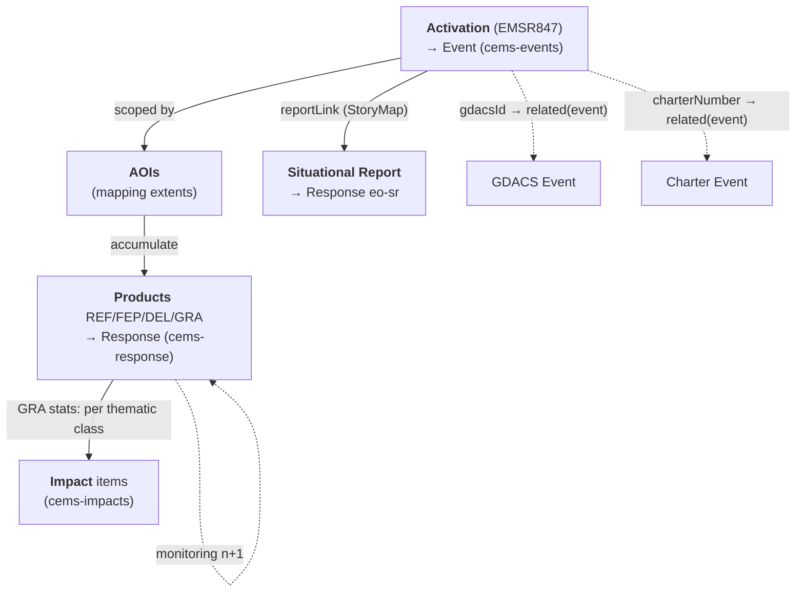

# Copernicus Emergency Management Service — Rapid Mapping

Copernicus EMS **Rapid Mapping (RM)** produces on-demand geospatial crisis
information — reference maps, delineations, and damage grading — for disasters
worldwide. Unlike the International Charter, CEMS exposes a **public JSON REST
API** (no STAC, no auth), so the ETL builds Monty STAC items directly from the API
payload. This document maps the CEMS RM object model to Monty STAC items.

> Scope: **Rapid Mapping only.** Risk & Recovery Mapping and EFFIS are out of scope
> (separate follow-ons). This is the WP1 data-model/ETL mapping; the RSS
> alert/listener (WP2 event-driven orchestration) is out of scope here.

## Collections

| Collection | Code | Monty role | Source for |
|------------|------|------------|------------|
| Copernicus EMS RM — Events | `cems-events` | `event` | Activation |
| Copernicus EMS RM — Response | `cems-response` | `response` | Product (REF / FEP / DEL / GRA) + Situational Report |
| Copernicus EMS RM — Impacts | `cems-impacts` | `impact` | GRA product damage/exposure statistics |

- **Source organisation**: Copernicus Emergency Management Service (`CEMS`)
- **Source URL**: <https://mapping.emergency.copernicus.eu/>
- **API entry point**: <https://rapidmapping.emergency.copernicus.eu/backend/dashboard-api/> (public, no auth)
- **License**: Copernicus data policy — free & open; attribution *"© European Union, Copernicus Emergency Management Service"*
- **Temporal coverage**: 2012 onwards (EMSR activation series); 224 RM activations as of 2026-07

> **No CEMS STAC extension exists.** Per the [response taxonomy](../../response-taxonomy.md)
> and [best practices](../../response-best-practices.md), CEMS-specific fields are
> carried under `monty:response_detail` (there is no `cems:` extension). Response
> items declare `monty` (+ `processing` recommended); source-imagery extensions
> (`sat:` / `eo:` / `sar:`) live on the linked **acquisition** items, not on the
> Response product — except where a raw dataset is the deliverable (not the CEMS case).

## Object model

### The activation → product flow

A CEMS **Activation** (code `EMSR{n}`, e.g. `EMSR847`) is opened for a disaster and
scoped by one or more **Areas of Interest (AOIs)**. Each AOI accumulates **Products**
through the Rapid Mapping lifecycle, and each product may be re-issued as timed
**monitoring** iterations:

```
REF (reference) → FEP (first estimate) → DEL (delineation) → GRA (grading)
                                            └─ monitoring 1, 2, … (same type, monitoringNumber++)
```

A **Situational Report (SR)** is an ArcGIS **StoryMap** published at activation level
(`reportLink`) — a produced report, not a per-AOI geospatial product.



### Object mapping

| CEMS object | Monty type | Monty `id` pattern | Collection |
|-------------|------------|--------------------|------------|
| Activation | Event | `cems-event-{code}` (e.g. `cems-event-EMSR847`) | `cems-events` |
| Product (REF/FEP/DEL/GRA) | Response | `cems-response-{code}-aoi{n}-{type}[-m{k}]` | `cems-response` |
| Situational Report (`reportLink`) | Response (`eo-sr`) | `cems-response-{code}-sr` | `cems-response` |
| GRA statistic (per thematic class) | Impact | `cems-impact-{code}-aoi{n}-gra-{thematic}[-m{k}]` | `cems-impacts` |
| Area of Interest (AOI) | — (geometry carrier, not emitted) | — | — |

- `{code}` is the activation code (`EMSR847`); `{n}` is the AOI `number`; `{type}` ∈
  `ref`/`fep`/`del`/`gra`; `-m{k}` is appended only for monitoring iterations
  (`monitoringNumber > 0`).
- **No `cems-hazards` collection.** The hazard is carried on the Event
  (`monty:hazard_codes`) and delineated by the `eo-del` Response. Whether a CEMS AOI
  warrants a standalone Hazard item (as Charter Areas do) is an open decision — see
  [Open decisions](#open-decisions).
- **AOIs are not emitted** as items; their `extent` is the geometry for the products
  they contain (and, if adopted, for any Hazard item).

## Data access

The **detail endpoint is the ETL unit** — one call returns the activation, its AOIs,
and every product (with images, stats, layers, downloads):

```bash
# Rich activation detail (ETL entry point) — returns {count,next,previous,results:[{…}]}
https://rapidmapping.emergency.copernicus.eu/backend/dashboard-api/public-activations/?code=EMSR847

# Activation list (discovery) — DRF pagination: ?limit=&offset= ; 224 RM activations
https://rapidmapping.emergency.copernicus.eu/backend/dashboard-api/public-activations-info/?limit=50
```

> [!IMPORTANT]
> - Public, no authentication; no rate limit observed during exploration.
> - The unified `mapping.emergency.copernicus.eu/activations/api/activations/` list has a
>   **different shape** (`category` is an object `{slug,name}`, adds `drmPhase`) and mixes
>   RM + Risk&Recovery — use the `rapidmapping` dashboard endpoints for RM ETL.
> - Assets live under `aws_bucket` / `productsPath`; per-product `downloadPath` (ZIP) and
>   `layers[]` (COG) give the deliverables; `images[].fileName` names the source imagery.

Reference fixtures in [`api-files/`](./api-files): `EMSR847` (storm; cross-source),
`EMSR871` (flood; has FEP), `EMSR842` (wildfire; minimal), and list samples.

## Activation → Event

Maps to a Monty Event item (`cems-events`); Monty extension only.

| CEMS field (activation) | Monty field | Notes |
|-------------------------|-------------|-------|
| `code` (`EMSR847`) | `id` (`cems-event-EMSR847`) | Prefix `cems-event-` |
| — | `collection: "cems-events"` | Required |
| `eventTime` | `datetime` / `start_datetime` | **Event onset** (not `activationTime`, which is when CEMS was tasked) |
| `name` | `title` | Direct copy |
| `reason` | `description` | Free-text situation summary |
| `centroid` (WKT POINT) | `geometry` | Parse WKT → GeoJSON Point; `extent` (WKT POLYGON) → `bbox` |
| `category` (+ `subCategory`) | `monty:hazard_codes` | Map via [Hazard codes](#hazard-codes) |
| `countries[].name` | `monty:country_codes` | Map country name → ISO 3166-1 alpha-3 |
| derived | `monty:corr_id` | Standard Monty algorithm (date/ISO3/spatial block/hazard/episode) — **not** the EMSR code |
| `gdacsId`, `charterNumber` | `links[rel=related]` | See [Cross-source linkage](#cross-source-linkage) |
| `reportLink`, source page | `links[rel=via]` | Activation page / StoryMap |

## Product → Response

Each product maps to a Monty Response item via `monty:response_detail`.

| CEMS field (product) | Monty field | Notes |
|----------------------|-------------|-------|
| `type` | `monty:response_detail.type` | `REF`→`eo-ref`, `FEP`→`eo-fep`, `DEL`→`eo-del`, `GRA`→`eo-gra` |
| `code` (activation) | `monty:response_detail.source_id` | e.g. `EMSR847` (source-system anchor) |
| `version.statusCode` | `monty:response_detail.status` | `F`→`finished`/`published`; `N` (not produced)→`withdrawn`. Confirm full enum (see [Open decisions](#open-decisions)) |
| `monitoring` / `monitoringNumber` | `monty:response_detail.monitoring_number` | Set **only** when `monitoring=true`; iteration links to the prior via `rel: prev` |
| `extent` (WKT) | `geometry` / `bbox` | Product footprint (AOI extent) |
| — | `monty:response_detail.producer` | `Copernicus EMS` (mapping provider) |
| — | `monty:response_detail.methodology` | `human_interpreted` (RM is expert-produced) |
| — | `monty:response_detail.sendai_targets` | Taxonomy default for the type code |
| `images[]` | `links[rel=derived_from]` → acquisition item(s) | Source imagery (`sensorType`, `sensorName`, `resolutionClass`, `acquisitionTime`) carries `sat:`/`eo:`/`sar:` on the acquisition, **not** on the Response |
| `layers[]` (COG), `downloadPath` (ZIP) | `assets` | Web layers + downloadable package |

**Situational Report** → one Response per activation, `type = eo-sr`, whose asset is the
`reportLink` StoryMap URL (no geospatial payload).

> **Do not** put damage/exposure statistics in `monty:response_detail` — those become
> separate **Impact** items (below). **Do not** set `status` from anything but
> `version.statusCode`.

## GRA statistics → Impact

Only **GRA** products carry `stats`, shaped as
`{thematic_class: {sub_class: {unit, total, affected}}}`, e.g.:

```json
{ "Estimated population": { "None": { "total": 84000 } },
  "Built-up [No.]":       { "None": { "affected": 48253 } } }
```

Per the [Response ↔ Impact boundary rules](../../response-impact-boundary.md), emit **one
Impact item per thematic class**:

- `monty:impact_detail`: `category`/`type` from the thematic class (population, buildings,
  roads, land use, burnt area, …), `value` = `affected` (fallback `total`), `unit` from the
  key/`unit` (`[No.]`, `[ha]`, `[km]`), `estimate_type: "primary"`.
- Canonical edge: **`Impact → derived_from → Response`** (the GRA Response), `roles: ["response"]`.
- Both items share the Event's `monty:corr_id`.
- Guard the `"NA"` / missing `total` case (skip or emit without a numeric value per boundary rules).
- Aggregated activation-level `stats` are the sum over AOIs — prefer per-product GRA `stats`
  to avoid double counting; if only activation `stats` exist, emit Impacts at Event level.

## Cross-source linkage

CEMS activations carry hard references to sibling sources. Beyond a shared
`monty:corr_id`, **derive the target Monty item id and emit an explicit `rel: related`
link** so the graph is directly navigable (65/224 sampled activations carry a `gdacsId`).

| CEMS field | Example | Target Monty id (derivation) | Link |
|------------|---------|------------------------------|------|
| `gdacsId` | `TC1001230` | GDACS `{eventtype}`+`{eventid}`; Monty id `{eventid}-{episodeid}` in `gdacs-events` → `1001230-{episode}` | `rel: related`, `roles: ["event"]` |
| `charterNumber` (+ `charterUrl`) | `996` | Charter Event `charter-event-{activation_id}` → `charter-event-996` (`charter-events`) | `rel: related`, `roles: ["event"]` (+ `["response"]` to Charter VAPs) |
| `relatedevents` | EMSR codes | `cems-event-{code}` | `rel: related`, `roles: ["event"]` |

This is a **reusable pattern**: any cross-reference field that yields a deterministic
source-item id becomes a typed `related` link, with `monty:corr_id` as the fallback join.
The edge is reciprocal — the Charter source doc already links VAPs to sibling Responses.
Open: GDACS episode resolution, and whether to emit links before the target is ingested
(see [Open decisions](#open-decisions)).

## Hazard codes

CEMS `category` (refine with `subCategory`) maps to Monty hazard codes. UNDRR-ISC 2025 is
required (exactly one per item); GLIDE and EM-DAT are recommended.

| CEMS `category` | UNDRR-ISC 2025 | GLIDE | EM-DAT | Notes |
|-----------------|----------------|-------|--------|-------|
| Flood | MH0600 | FL | nat-hyd-flo-flo | Refine to MH0603/MH0604 (flash/riverine) |
| Wildfire | MH1301 | WF | nat-cli-wil-for | |
| Storm | MH0400 | ST | nat-met-sto | Refine to MH0403/`TC`/`nat-met-sto-tro` when `subCategory` = tropical cyclone/hurricane/typhoon |
| Earthquake | GH0101 | EQ | nat-geo-ear-gro | |
| Mass movement | MH0901 | LS | nat-geo-mmd-lan | Landslide/mass movement |
| Industrial accident | TH03xx / TH06xx | — | tec-ind | Technological — pick chemical vs explosion from `subCategory` (manual review) |
| Transport accident | — | — | tec-tra | Technological — no clean UNDRR-ISC; manual review |
| Other | — | OT | — | No code — manual review |

Apply `hazard_profiles.get_canonical_hazard_codes()` after mapping.

## Reference files

Real upstream CEMS API responses, used as mapping fixtures:

- [`api-files/EMSR847-storm-detail.json`](./api-files/EMSR847-storm-detail.json) — Tropical Cyclone Melissa; 39 AOIs, 67 products, monitoring, carries `gdacsId` **and** `charterNumber`/`charterUrl`
- [`api-files/EMSR871-flood-detail.json`](./api-files/EMSR871-flood-detail.json) — flood; contains FEP + DEL + GRA
- [`api-files/EMSR842-wildfire-detail.json`](./api-files/EMSR842-wildfire-detail.json) — wildfire; minimal (2 GRA)
- [`api-files/rapidmapping-activations-list.json`](./api-files/rapidmapping-activations-list.json) — list endpoint (pagination)
- [`api-files/unified-activations-list.json`](./api-files/unified-activations-list.json) — unified endpoint (different shape)

See [`FINDINGS.md`](./FINDINGS.md) for the raw familiarisation notes (esa-montandon#20).

## Open decisions

1. **`statusCode` enum** — only `F` (final) and `N` (not produced) observed; confirm the
   full set historically and finalise the `monty:response_detail.status` mapping.
2. **Hazard items** — model the hazard only on the Event (current choice), or also emit a
   `cems-hazards` item per AOI (Charter-style) / from the DEL delineation?
3. **AOI geometry** — per-AOI vs per-product `extent` for Response items (both are present).
4. **Monitoring lineage** — `rel: prev` between iteration *n* and *n-1* keyed by
   `monitoringNumber` (and/or `version.number`).
5. **Source imagery** — emit linked acquisition items (from `images[]`, carrying
   `sat:`/`eo:`/`sar:`) via `derived_from`, or keep `images[]` as product metadata only.
6. **Cross-source links** — resolve GDACS episode; emit `related` links unconditionally
   (deterministic id) or only when the target is present in Montandon.
7. **Impact granularity** — per-product GRA `stats` vs aggregated activation `stats`
   (avoid double counting).

## Resources

- [CEMS Rapid Mapping portal](https://rapidmapping.emergency.copernicus.eu/)
- [Rapid Mapping product portfolio](https://mapping.emergency.copernicus.eu/about/rapid-mapping-portfolio/)
- [How to harvest CEMS Mapping data](https://mapping.emergency.copernicus.eu/about/how-to-harvest-cems-mapping-data/)
- [Response taxonomy](../../response-taxonomy.md) · [Response best practices](../../response-best-practices.md) · [Response ↔ Impact boundary](../../response-impact-boundary.md)
- [Monty STAC Extension specification](../../../../README.md)
