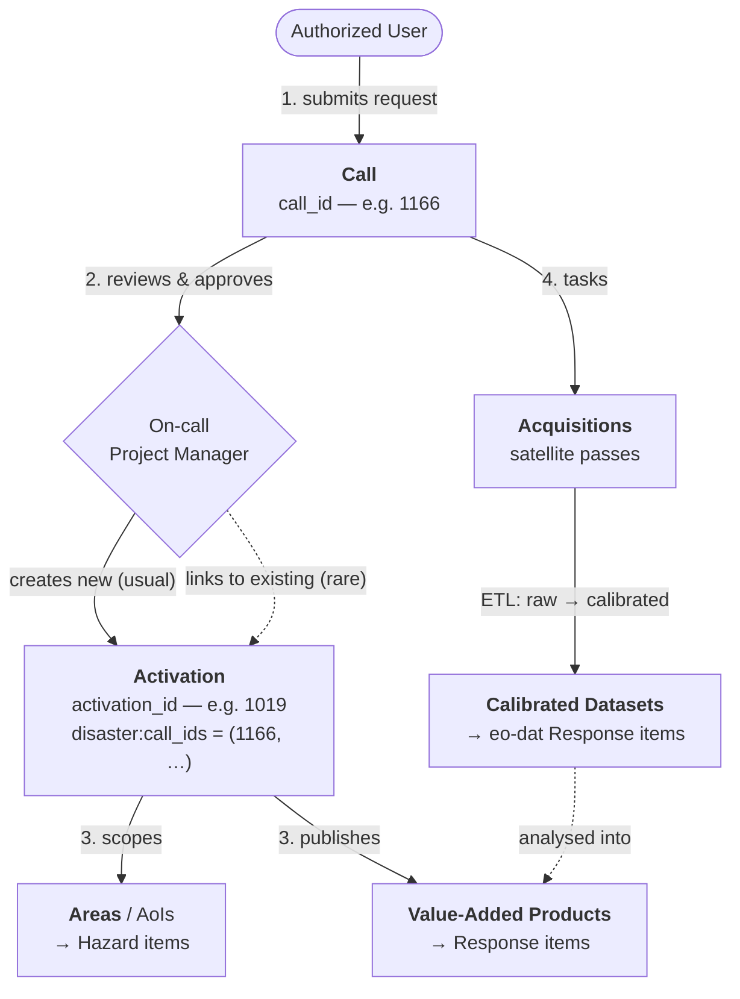
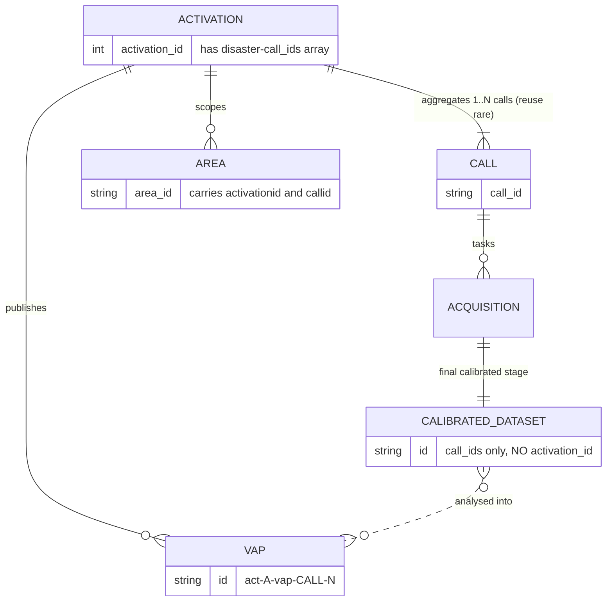

# International Charter on Space and Major Disasters

The International Charter coordinates satellite data delivery for disaster
response worldwide. An **Activation** groups the areas of interest (AoIs) and the
Value-Added Products (VAPs); the underlying satellite **Acquisitions** are grouped
under the **Call** that triggered them. This document maps the Charter object
model — as exposed by the Charter Mapper on **S3** (our ingestion entry point) —
to Monty STAC items.

## Collections

| Collection | Code | Monty role | Source for |
|------------|------|------------|------------|
| International Charter — Events | `charter-events` | `event` | Activation |
| International Charter — Hazards | `charter-hazards` | `hazard` | Area (AoI) |
| International Charter — Response | `charter-response` | `response` | Value-Added Product and calibrated acquisition dataset |

- **Source organisation**: International Charter on Space and Major Disasters (`CHARTER`)
- **Source URL**: <https://disasterscharter.org>
- **Ingestion entry point (S3)**: `s3://cpe-operations-catalog/` (Charter Mapper catalog, JSON-only partner access)
- **Discovery API**: <https://supervisor.disasterscharter.org/api/> (browsing only)
- **License**: partner access (Terradue-granted, IP-allowlisted)
- **Temporal coverage**: 2000-11-05 onwards (Charter formation)

## Conversion principle — copy-as-is + Montandon specifics

> The Charter Mapper already publishes valid STAC, so the conversion is a
> **pass-through**: each source item is carried over **as-is** — geometry, `bbox`,
> assets, the imagery extensions (`eo:` / `sar:` / `sat:` / `view:` / `proj:` /
> `processing:`), `providers`, and the Charter-native `disaster:` fields are all
> **preserved**. The ETL only does two things on top:
>
> 1. **Fix STAC-level consistency issues** — normalise the legacy Terradue
>    `disaster:` v1.0.0 declaration to
>    [v1.1.0](#the-terradue-disaster-extension) (lowercase `disaster:class`,
>    plural `disaster:types` / `disaster:regions`), set `stac_version`, drop
>    null/internal bookkeeping fields, and repair anything that fails STAC validation.
> 2. **Add the Montandon specifics** — the `monty` extension plus `monty:corr_id`,
>    `monty:country_codes`, `monty:hazard_codes`, `monty:response_detail`, the
>    `event` / `hazard` / `response` `roles`, the Monty `id` and `collection`, and
>    the typed `related` / `derived_from` links.
>
> Everything else in the source item is left untouched. The mapping tables below
> describe only these two deltas — assume every other field rides along unchanged.

## Object model

### The process flow (Call → Activation → Areas/VAPs, Call → Acquisitions)

The Charter data model is easier to read once the [activation
process](https://disasterscharter.org/charter-activation-process) is understood.
The **Call is emitted first**, and the **Activation is the confusing pivot** —
acquisitions never attach to it directly.

1. An **Authorized User** submits a request → a **Call** is created (`call_id`,
   e.g. `1166`). This is the first object to exist.
2. The **on-call Project Manager** reviews and approves the call, which then
   **creates a new Activation** (`activation_id`, e.g. `1019`) or — more rarely —
   is **linked to an existing** activation. A Call therefore belongs to exactly
   one Activation, but an Activation can aggregate several Calls (its
   `disaster:call_ids` is an array).
3. **Attached to the Activation**: the **Areas** (AoIs) and the **Value-Added
   Products (VAPs)** — the human-interpreted map products.
4. **Attached to the Call**: the **Acquisitions** (satellite tasking) and *all
   downstream production*, including the progressively processed **calibrated
   datasets**.



**The most confusing association**: a calibrated dataset carries **only** its
`disaster:call_ids` — it has **no `activation_id`**. To reach the Event, resolve
**call → activation** (the Activation lists the call in `disaster:call_ids`, and
also links each calibrated dataset via `rel: related`). Never expect the
activation id on the dataset itself.

### Entities and how they are keyed



### Monty mapping

Charter exposes **five** object types. Four are emitted as Monty items via the
Terradue `disaster:` extension (`disaster:class`); the fifth — `Call` — is a
process pivot Monty does not emit but references through its `call_id`.

| Charter object (`disaster:class`) | Monty type | Monty `id` pattern | Keyed by | Collection |
|-----------------------------------|------------|--------------------|----------|------------|
| `Activation` | Event | `charter-event-{activation_id}` | activation | `charter-events` |
| `Area` | Hazard | `charter-hazard-{activation_id}-{area_id}-{type}` | activation | `charter-hazards` |
| `Call` | — (process pivot — for reference, not emitted) | — | — | — |
| `ValueAddedProduct` | Response | `charter-response-{activation_id}-{call_id}-{vap_number}` | activation (+ call in id) | `charter-response` |
| `Acquisition` / Dataset (**calibrated** stage) | Response (`eo-dat`) | `charter-response-{call_id}-{dataset_id}` | **call** | `charter-response` |

> Both **VAPs** and **calibrated acquisition datasets** become Monty Response items
> in `charter-response`. VAPs map to derived EO product codes (`eo-del`, `eo-gra`,
> `eo-vap`, …) and are keyed by activation. Calibrated datasets map to `eo-dat`
> and are keyed by **call** (they are call-native), matching the source: their
> Monty id omits the activation, which is surfaced only via `monty:corr_id` and
> the `related` links. Keep only the **last, calibrated stage** as the Response
> item; earlier ETL-stage records are intermediate artifacts. **All** entries of
> the call's `calibratedDatasets` collection are sourced — including the global
> reference layers published as `{...}_Auxiliary_Dataset_*` (DEM, land cover,
> surface water, HAND, population, settlement).
>
> A VAP links to the calibrated dataset it was analysed from as a **sibling
> Response** (`rel: related`, `roles: ["response"]`), not via `derived_from` —
> both are Response items.

`{area_id}` is the upstream Area `id`, lowercased (e.g.
`AOI_1_Epi_0-iNglWjcFF0v3rBHi3s1_fQ__` → `aoi_1_epi_0-inglwjcff0v3rbhi3s1_fq__`).
`{call_id}-{vap_number}` is the VAP identifier from the upstream `<identifier>`
(e.g. `1166-19`). `{dataset_id}` is a short URL-safe slug for the calibrated
dataset used inside the Monty item `id`; the full upstream dataset identifier is
preserved separately in `monty:response_detail.source_id`.

> The `Call` object is never emitted as its own item. Its `call_id` is carried on
> Response items (via `disaster:call_ids` and the `{call_id}` segment of the item
> `id`) and surfaced on the Event through the activation title (e.g.
> `[Act-1019/Call-1166]`) and the linked Response items — Events are Monty-only and
> do not declare `disaster:call_ids` directly.

## Data access

Montandon ingests the Charter Mapper catalog from the OTC OBS/**S3** bucket
`cpe-operations-catalog` (see [Remote Server & Object
Storage](../../../../AGENTS.md)). Terradue granted **JSON-only** read access
(IP-allowlisted). The S3 layout mirrors the object model — **activation-scoped**
items under `activations/…`, **call-scoped** items under `calls/…`:

```text
s3://cpe-operations-catalog/
├── catalog.json
├── activations/act-{activation_id}/
│   ├── act-{activation_id}.json                                     # Activation → Event
│   ├── {hazard}.png                                                 # thumbnail asset
│   ├── primary-{call_id}.kml                                        # AoI KML asset
│   ├── areas/{area_id}.json                                         # Area → Hazard
│   └── vaps/act-{activation_id}-vap-{call_id}-{n}/
│       └── act-{activation_id}-vap-{call_id}-{n}.json               # VAP → Response ✅
└── calls/call-{call_id}/
    └── calibratedDatasets/{dataset_id}-calibrated/
        └── {dataset_id}-calibrated.json                            # calibrated Acquisition → eo-dat Response ✅
```

Note the split: **acquisitions live under `calls/call-{call_id}/…`, never under
the activation** — the Activation only *links* to them (`rel: related`) and lists
the call in `disaster:call_ids`. VAPs and Areas live under
`activations/act-{activation_id}/…`.

> [!IMPORTANT]
> **Access policy**: `GetObject` works for **JSON** under `activations/…` and
> `calls/…`. It does **not** work for non-JSON assets (PDF, quicklook, raw
> imagery). Activations older than **Act 994 / Call 1136** may be in cold storage
> until restored.
>
> Probe from `montandon-dev`: `uv run test.py` (canonical copy: `scripts/charter-obs-test.py`).

### HTTP API — discovery only

The public Supervisor API (`https://supervisor.disasterscharter.org/api/`) mirrors
the same STAC but with a slightly different layout (`calls/{call_id}/acquisitions/calibratedDatasets.json`,
no `call-` prefix) and is only used for browsing/discovery — the sample
[`api-files/`](./api-files) fixtures were pulled from it. It is slow (catalog
endpoints are dynamically generated) and some `self` links carry a `.json` suffix
that returns HTTP 500. Alternative browsing:
[STAC Index](https://stacindex.org/catalogs/disasters-charter-mapper-catalog).

## Update & polling strategy (ETL)

Charter objects are revised **independently** — there is no "the activation
changes first" rule at *update* time. The only ordering constraint is at
*creation* (Call → Activation → Areas/VAPs, and Call → Acquisitions; see [the process flow](#the-process-flow-call--activation--areasvaps-call--acquisitions)).
So all of the following happen and the ETL must poll each entity on its own:

- a VAP is added (or, rarely, revised) while its Activation is untouched;
- an Area is added/refined while the Activation is untouched;
- a calibrated dataset changes (recalibration / new pass) with nothing else moving;
- any combination of the above.

### Where each entity is polled

Because **Areas and VAPs are activation-scoped but Acquisitions/datasets are
call-scoped**, a single crawl of the activation prefix does **not** surface
dataset changes. Poll two prefixes per event:

| Entity | Monty item | Poll scope (S3) | Update behaviour | Primary change signal |
|--------|-----------|-----------------|------------------|-----------------------|
| Activation | Event | `activations/act-{activation_id}/act-{activation_id}.json` | Rarely mutated after onset; `cpe:activation_status` moves `open → closed → archived` | `cpe:activation_status` transition + object `ETag` |
| Area | Hazard | `activations/act-{activation_id}/areas/` | May be added/refined independently; carries no `created` field | new object appears; object `ETag` |
| VAP | Response (`eo-*`) | `activations/act-{activation_id}/vaps/` | Almost always **create-only**; revision is rare | new object appears |
| Calibrated dataset | Response (`eo-dat`) | `calls/call-{call_id}/calibratedDatasets/` — one prefix **per call** in `disaster:call_ids` | **Most volatile** — datasets appear and are re-processed throughout ingestion/calibration | new object; object `ETag`; `cpe:status.stage` |

> The call list comes from the Activation's `disaster:call_ids`. Resolve
> **call → activation** once, then poll each `calls/call-{call_id}/…` prefix on
> its own cadence — never assume a dataset change is reflected in the Activation's
> own object (it is not: acquisitions never attach to the activation).

### Detecting a real change

> [!IMPORTANT]
> **`properties.updated` is not a reliable content-change signal.** The Charter
> Mapper periodically **republishes the whole catalog**, stamping every item in an
> activation/call with a near-identical `updated` even when the payload is
> unchanged — e.g. all four Act-1019 Areas share `2026-06-10T07:56:21Z`, and every
> Act-1019 calibrated dataset shows `2026-07-06T06:4x`. A naive `created ≠ updated`
> test therefore yields **false positives**.

Use, in order of reliability:

1. **S3 object `ETag` / `LastModified`** (from `ListObjectsV2` on the prefix) — the
   authoritative "did this JSON change" signal, immune to the republish caveat.
   Store the last-seen `ETag` per object key and re-ingest only when it changes;
   the listing is metadata-only and cheap. (Note S3 `ETag` is a content hash only
   for non-multipart objects — these small JSONs qualify; otherwise hash the
   normalised body yourself.)
2. **`properties.created`** — the true production timestamp, stable across
   republishes and the best signal for "is this object **new** since the last poll".
3. **`cpe:status.stage`** (acquisitions only) — lifecycle marker. The
   `calibratedDatasets` collection already holds only the `calibratedDataset`
   stage, but a dataset can be re-emitted at that stage after re-processing, so
   combine it with the `ETag`.

### Cadence

Drive polling frequency from the activation lifecycle (`cpe:activation_status`):

| Status | Meaning | Suggested cadence |
|--------|---------|-------------------|
| `open` (or activation only days old) | Active response — calibration and VAP production ongoing | frequent (e.g. hourly) |
| `closed` | Response wound down; late VAPs still possible | daily |
| `archived` | Cold; objects may be in **cold storage** (Act < 994 / Call < 1136) and unreadable until restored | rare / on-demand only |

### Re-emission (idempotency)

The Monty `id` and `monty:corr_id` are **stable** across updates: on a detected
change, recompute the item and **overwrite** the existing Monty item at the same
id. A dataset re-processed under the same `{dataset_id}` is a content update on the
same Response id (not a new item); a new sensor pass is a new id. Withdrawal or
deletion of an upstream object is rare and is handled by removing the corresponding
Monty item.

## The Terradue `disaster:` extension

Charter is the live data model for the Terradue `disaster:` extension. Upstream
Charter STAC declares the **legacy** URL
`https://terradue.github.io/disaster/v1.0.0/schema.json`; Monty Response items
declare the current URL
`https://terradue.github.io/stac-extensions-disaster/v1.1.0/schema.json`. Field
**semantics** are identical, but field **names and value casing changed**. Apply
this normalization when mapping:

| Upstream (legacy v1.0.0) | Monty (v1.1.0) | Notes |
|--------------------------|----------------|-------|
| `disaster:class: "Activation"` / `"Area"` / `"ValueAddedProduct"` | `disaster:class: "activation"` / `"area"` / `"vap"` | Lowercased |
| `disaster:type` | `disaster:types` | Renamed (singular → plural) |
| `disaster:region` | `disaster:regions` | Renamed (singular → plural) |
| `cpe:activation_status` | `disaster:activation_status` | Lifecycle: `open` / `closed` / `archived` |
| `disaster:activation_id`, `disaster:call_ids`, `disaster:country` | (unchanged) | Direct copy |
| *(absent upstream)* | `disaster:resolution_class` | Inferred — see [VAP → Response](#value-added-product--response-v130) |

> Events and Hazards are modelled as **Monty-only** items (they carry the mapped
> values in `monty:` fields and do **not** declare `disaster:`). Response items
> (VAPs and calibrated acquisitions) layer the `disaster:` extension — see
> [VAP → Response](#value-added-product--response-v130) and
> [Calibrated acquisition → Response](#calibrated-acquisition--response-eo-dat).

## Activation → Event

Maps to a Monty Event item (`charter-events`). Declares the Monty extension only.

| Charter field (activation) | Monty field | Notes |
|----------------------------|-------------|-------|
| `id` (`act-1000`) | `id` (`charter-event-1000`) | Prefix `charter-event-` |
| — | `collection: "charter-events"` | Required |
| `properties.datetime` | `datetime` | Event onset (see note) |
| `properties.title` | `title` | Direct copy |
| `geometry` (Point) | `geometry` | Direct copy |
| `disaster:type` | `monty:hazard_codes` | Map via [Hazard codes](#hazard-codes) |
| `disaster:country` | `monty:country_codes[0]` | Already ISO 3166-1 alpha-3 |
| `links[rel=self]` | `links[rel=via]` | Source reference |

> [!IMPORTANT]
> **Onset datetime**: use `properties.datetime` — it equals `properties.created`
> and the embedded `<disasterDate>` in `cpe:cos2_xml`. Do **not** use
> `properties.updated` (processing close date, often weeks later).

**Multi-hazard**: include every hazard code on the Event. For
`disaster:type: ["flood", "landslide"]` carry both `MH0600`/`FL`/`nat-hyd-flo-flo`
and `GH0300`/`LS`/`nat-geo-mmd-lan`.

**Correlation ID** (`monty:corr_id`): generated by the standard Monty algorithm
from event date, ISO3 country, spatial block, primary hazard, and episode —
format `{YYYYMMDD}-{ISO3}-{spatial_block}-{UNDRR-ISC}-{episode}-GCDB`, e.g.
`20251103-AFG-1138838-GH0101-1-GCDB`. The numeric block is a spatial identifier,
**not** the Charter `activation_id`. All items for the same event share it.

Full example: [`charter-event-1000.json`](../../../../examples/charter-events/charter-event-1000.json).

## Area → Hazard

Maps to a Monty Hazard item (`charter-hazards`). Declares the Monty extension only.

| Charter field (area) | Monty field | Notes |
|----------------------|-------------|-------|
| `id` | `id` | `charter-hazard-{activation_id}-{area_id}-{type}` |
| — | `collection: "charter-hazards"` | Required |
| `geometry` (Polygon) | `geometry` | Full AoI polygon |
| `properties.title` | `title` | Area name (e.g. `Juiz de Fora`) |
| `disaster:type` | `monty:hazard_codes` | **One code set per item** (see below) |
| `disaster:country` | `monty:country_codes` | Inherited from activation |
| parent activation `datetime` | `datetime` | Inherited from activation |
| `properties.description` | `monty:hazard_detail` | Parse severity (see below) |
| `cpe:status.stage` | `monty:hazard_detail.estimate_type` | See below |
| parent activation | `links[rel=derived_from]` | `../charter-events/charter-event-{id}.json` |

> [!IMPORTANT]
> **Multi-hazard strategy**: create **one Hazard item per disaster type**
> (GDACS precedent), same geometry, different `monty:hazard_codes`. For an Area
> with `disaster:type: ["flood", "landslide"]`:
> - `charter-hazard-1019-juiz_de_fora…-flood` → `MH0600`, `FL`, `nat-hyd-flo-flo`
> - `charter-hazard-1019-juiz_de_fora…-landslide` → `GH0300`, `LS`, `nat-geo-mmd-lan`
>
> This satisfies the schema requirement of exactly one UNDRR-ISC 2025 code per item.

**Severity** — the Area `description` is a flat key/value string, e.g.
`Call-1166 AoI ID: 1, Priority: 1, Radius (km): 8.0, Lat: -21.759126, Long: -43.360292, SurfaceArea: 201, Comment:`.
`monty:hazard_detail` requires `severity_value` + `severity_unit`; derive them as:

| Source key | When | `monty:hazard_detail` |
|------------|------|-----------------------|
| `Radius (km)` | present (circular AoIs) | `severity_value`, `severity_unit: "km"`, `severity_label: "Area radius"` |
| `SurfaceArea` | fallback (polygon AoIs, no radius) | `severity_value`, `severity_unit: "km2"`, `severity_label: "Surface area"` |

`Priority` is operational AoI ordering, not a hazard severity, and is not carried
in the Monty schema. `Lat`/`Long` describe the AoI centre and are already
represented by `geometry`.

**Estimate type** — map `cpe:status.stage` to `monty:hazard_detail.estimate_type`
(enum `primary` / `secondary` / `modelled`). Observed stages (`notificationNew`,
`notificationImported`) and any unrecognized stage map to `primary`. This is an
interim mapping pending full CPE stage documentation.

## Value-Added Product → Response (v1.3.0)

Charter VAPs map to Monty Response items via the v1.3.0 `monty:response_detail`
object and the `response` role. This is the Charter-specific application of the
cross-source guidance in
[`response-best-practices.md`](../../response-best-practices.md) (§3.2) and the
response-type codes in [`response-taxonomy.md`](../../response-taxonomy.md) (§2.1).

### Extension layering (do not duplicate)

VAP Response items declare two extensions:

| Extension | Requirement | Carries |
|-----------|-------------|---------|
| `…/monty-stac-extension/v1.3.0/schema.json` | **Required** | `monty:response_detail`, `response` role, correlation, country/hazard codes |
| `…/stac-extensions-disaster/v1.1.0/schema.json` | **Required** | Charter-native fields (`disaster:class`, `disaster:activation_id`, …) |
| `…/processing/v1.2.0/schema.json` | Recommended | Processing level / lineage of the derived product |

The governing rule is **extension layering over duplication**: any concept
already expressed by a `disaster:` field is canonical there and **MUST NOT** be
copied into `monty:response_detail`.

### Field carriage

Most `disaster:` fields are **not** present on the source VAP JSON (which only
carries `disaster:class` and `disaster:activation_id`); they are enriched from
the parent Activation/Area or inferred, then normalized per
[the `disaster:` extension table](#the-terradue-disaster-extension).

| Concept | Carried as | Source |
|---------|------------|--------|
| Charter object type | `disaster:class = "vap"` | VAP `disaster:class` (`ValueAddedProduct`) |
| Activation id | `disaster:activation_id` | VAP |
| Call id(s) | `disaster:call_ids` | VAP `id` / `<identifier>` (`{call_id}-{vap_number}`); not on the VAP item as a `disaster:` field |
| Hazard types | `disaster:types` (+ `monty:hazard_codes`) | Activation `disaster:type` |
| Country | `disaster:country` (+ `monty:country_codes`) | Activation |
| Activation status | `disaster:activation_status` | Activation `cpe:activation_status` |
| Resolution class | `disaster:resolution_class` | Inferred from acquisition / VAP copyright |
| Product type code | `monty:response_detail.type` | Classified — see below |
| VAP identifier | `monty:response_detail.source_id` (`1144-1`) | VAP `<identifier>` (`{call_id}-{vap_number}`) |
| Producer | `monty:response_detail.producer` | VAP copyright (e.g. `Airbus`) |
| Methodology | `monty:response_detail.methodology` | Per product nature (e.g. `human_interpreted`) |
| Sendai targets | `monty:response_detail.sendai_targets` | Taxonomy default for the type code |

> **Do not** set `monty:response_detail.status` — activation lifecycle is carried
> on `disaster:activation_status`. **Do not** put damage/exposure statistics in
> `monty:response_detail`; those become separate Monty **Impact** items
> (`roles: ["impact"]`) linked via `monty:corr_id`.

**Product type classification** — the `disaster:` extension does not distinguish
delineation from grading, so classify best-effort from the VAP title/description:
damage assessment → `eo-gra`, affected-area extent → `eo-del`, population
exposure → `eo-pop`. Fall back to `eo-vap` when the type cannot be determined.
Do not encode the source into the code (`eo-gra`, never `eo-charter-gra`).

**Resolution / producer inference** — when `disaster:resolution_class` is absent
upstream, infer it from the acquisition metadata or VAP copyright. Example:
copyright `"Includes Pleiades material © CNES (2025), Distribution Airbus DS."`
→ `disaster:resolution_class: "VHR"`, `producer: "Airbus"`.

### Linkage

| `rel` | Target | Link `roles` | Purpose |
|-------|--------|--------------|---------|
| `related` | Event item | `["event"]` | Parent Charter Event |
| `related` | Hazard item(s) | `["hazard"]` | Hazard(s) the response addresses |
| `related` | Calibrated acquisition (`eo-dat`) Response item(s) | `["response"]` | The calibrated dataset the VAP was built from — a **sibling Response**, so linked as `related`/`response`, not `derived_from` |
| `related` | other Response item(s) | `["response"]` | Sibling response cross-reference |
| `derived_from` | Charter activation page | — | Upstream source page the item is derived from |

> Typed `related` links use a single role from `event` / `hazard` / `impact` /
> `response` (per the Monty schema). The main spec also defines the equivalent
> shorthand `rel` values `related-hazard` / `related-impact` / `related-response`;
> Charter items use the `rel: related` + `roles` form throughout.

Correlation back to the Event/Hazard uses the shared `monty:corr_id`.

### Example

[`charter-response-1000-1144-1.json`](../../../../examples/charter-response/charter-response-1000-1144-1.json)
is the canonical worked example (Act-1000 VAP `1144-1`, an `eo-gra` damage
assessment). Its `monty:response_detail`:

```json
{
  "type": "eo-gra",
  "source_id": "1144-1",
  "producer": "Airbus",
  "methodology": "human_interpreted",
  "sendai_targets": ["C", "D"]
}
```

Note the absence of `status`, `resolution_class`, and `activation_id` — those are
carried by the `disaster:` extension on the same item.

## Calibrated acquisition → Response (`eo-dat`)

Calibrated acquisition datasets map to Monty Response items
(**`charter-response-{call_id}-{dataset_id}`** — call-keyed, since the source is
call-native) with `monty:response_detail.type = eo-dat`. Because the deliverable
*is* the dataset, the Response item and the acquisition item coincide: declare
`disaster:class = acquisition` plus the imagery-layer extensions already present
upstream (`eo:` / `sar:` / `sat:` / `view:` / `proj:` / `processing:`) directly on
the Response item. See [Response Best Practices §4.4](../../response-best-practices.md#44-charter-raw-acquisition-delivered-to-responders-eo-dat).

**Source (S3):**

```text
s3://cpe-operations-catalog/calls/call-{call_id}/calibratedDatasets/{dataset_id}-calibrated/{dataset_id}-calibrated.json
```

The collection is `disaster:class = "Acquisition"`, `cpe:status.stage =
"calibratedDataset"`. **Every** item in it is sourced as an `eo-dat` Response —
both the sensor acquisitions (Pléiades, Sentinel, Landsat, TerraSAR-X, …) and the
global reference layers published as `{...}_Auxiliary_Dataset_*` (Copernicus DEM,
ESA WorldCover, JRC Global Surface Water, MERIT HAND, WorldPop, DLR WSF). An
acquisition may appear at several ETL stages upstream; the `calibratedDatasets`
collection already holds only the **last, calibrated stage**, so no stage
filtering is needed.

| Concept | Carried as | Source |
|---------|------------|--------|
| Charter object type | `disaster:class = "acquisition"` | Dataset STAC item (normalize case) |
| Call id(s) | `disaster:call_ids` | Dataset item (**native**) |
| Activation id | *(not on the item)* | **Resolve `call → activation`** — the Activation lists this call in `disaster:call_ids`; used for `monty:corr_id` only, not the item id |
| Hazard types | `disaster:types` (+ `monty:hazard_codes`) | Dataset `disaster:type` (also present on the item) |
| Country | `disaster:country` (+ `monty:country_codes`) | Resolved activation |
| Resolution class | `disaster:resolution_class` | Dataset item (`VHR` / `HR` / `MR` / …) |
| Product type code | `monty:response_detail.type = "eo-dat"` | Fixed |
| Dataset identifier | `monty:response_detail.source_id` | Full upstream dataset id (e.g. `DS_PHR1A_202603021304008_FR1_PX_W044S22_0907_00777`); the `{dataset_id}` slug in the item `id` is a short URL-safe form of it |
| Producer | `monty:response_detail.producer` | Dataset `providers[].name` (e.g. `Airbus`, `USGS/NASA`, `ESA/EC (Copernicus)`, `DLR`) |
| Sensor / orbit / cloud cover | `eo:` / `sar:` / `sat:` fields | Dataset item (already present) |

VAP Response items link to the calibrated datasets they were analysed from as a
**sibling Response** (`rel: related`, `roles: ["response"]`), since the calibrated
dataset is itself an `eo-dat` Response item. Reserve `derived_from` for the
upstream Charter source page.

## Hazard codes

`disaster:type` values map to Monty hazard codes. UNDRR-ISC 2025 is required
(exactly one per Hazard item); GLIDE and EM-DAT are optional but recommended.

| `disaster:type` | UNDRR-ISC 2025 | GLIDE | EM-DAT | Notes |
|-----------------|----------------|-------|--------|-------|
| `flood` | MH0600 | FL | nat-hyd-flo-flo | Refine to MH0603/MH0604 if flash/riverine |
| `fire` | EN0205 | WF | nat-cli-wil-for | Wildfire / forest fire |
| `earthquake` | GH0101 | EQ | nat-geo-ear-gro | Ground shaking |
| `volcano` | GH0201 | VO | nat-geo-vol | Volcanic eruption (chapeau) |
| `storm_hurricane` | — | ST | nat-met-sto | No single UNDRR-ISC chapeau; refine to **MH0306** if tropical (see `cyclone`) |
| `cyclone` | MH0306 | TC | nat-met-sto-tro | Tropical cyclone (matches the GDACS TC convention) |
| `tsunami` | MH0705 | TS | nat-geo-ear-tsu | |
| `landslide` | GH0300 | LS | nat-geo-mmd-lan | Chapeau, matching GDACS/EM-DAT/GLIDE convention |
| `snow_hazard` | — | OT | — | No single UNDRR-ISC/GLIDE code fits; candidates are MH0403 (Blizzard) or MH0503–MH0509 (severe winter conditions) depending on the actual event — manual review against real Charter payloads |
| `ice` | MH0502 | CW | nat-met-ext-col | Cold wave (chapeau); refine to MH0509 (Icing) or MH0506 (Freezing rain) per event detail |
| `oil_spill` | CH0203 | — | tec-ind-oil-oil | Oil spill — canonically classified under the Chemical/Carcinogens cluster in `taxonomy.md`, not Technological; EM-DAT key corrected from `tec-ind-che` (Chemical Spill) |
| `explosive_event` | TL0304 | — | tec-ind-exp | Explosion (technological) |
| `other` | — | OT | — | No UNDRR code — manual review required |

> **Corrected 2026-07-16**: this table previously used `MH0403` (*Blizzard*, not Tropical Cyclone)
> for `cyclone`, `MH1301` for `fire` and `MH0901` for `landslide` (neither exists in the UNDRR-ISC
> 2025 list), `GH0301` (*Falls*, not Tsunami) for `tsunami`, `MH0801` (*Avalanche*, not ice/cold) for
> `ice`, `MH1202` and a fabricated GLIDE code `SW` for `snow_hazard`, and the wrong prefix
> `TH0300`/`TH0600` for `oil_spill`/`explosive_event`. All values above are verified against
> [`docs/model/taxonomy.md`](../../taxonomy.md#complete-2025-hazard-list) and its Cross-Classification
> Mapping table. See IFRCGo/monty-stac-extension#61.

> **`get_canonical_hazard_codes()` does not validate this table.** That function preserves any code
> that is already a syntactically valid UNDRR-ISC 2025 code — it does not check that the code is the
> *correct* one for the mapped `disaster:type` (see IFRCGo/pystac-monty#168, where USGS shipped the
> valid-but-wrong `GH0311` for years undetected). The mapping above must be correct at the source;
> canonicalisation is formatting, not verification.

## Examples

| Activation | Type | Country | Files |
|------------|------|---------|-------|
| Act-1000 | Earthquake | AFG | [event](../../../../examples/charter-events/charter-event-1000.json), [response](../../../../examples/charter-response/charter-response-1000-1144-1.json) |
| Act-1019 | Flood + landslide | BRA | [event](../../../../examples/charter-events/charter-event-1019.json) (multi-hazard) |

## Reference files

Actual upstream Charter responses, used as mapping fixtures:

- [`act-1000-activation.json`](./act-1000-activation.json) — single-hazard activation (earthquake)
- [`act-1000-area-epi.json`](./act-1000-area-epi.json) — polygon AoI (no radius)
- [`act-1000-vap-1144-1.json`](./act-1000-vap-1144-1.json) — VAP STAC item (damage assessment)
- [`act-1019-activation.json`](./act-1019-activation.json) — multi-hazard activation (flood + landslide)
- [`act-1019-area-juiz-de-fora.json`](./act-1019-area-juiz-de-fora.json) — circular AoI (with radius)

The [`api-files/`](./api-files) folder holds the **S3-model** fixtures backing
this analysis (Act-1019 / Call-1166, Flood in Brazil):

- [`act-1019.json`](./api-files/act-1019.json) — Activation, with `related` links to Areas **and** to the call's calibrated datasets
- [`activation-1019-areas.json`](./api-files/activation-1019-areas.json) — the four Areas (each carries both `callid` and `activationid`)
- [`act-1019-vaps.json`](./api-files/act-1019-vaps.json) — per-activation VAP catalog; [`act-1019-vap-1166-19.json`](./api-files/act-1019-vap-1166-19.json), [`act-1019-vap-1166-22.json`](./api-files/act-1019-vap-1166-22.json) — VAP items (`disaster:activation_id` only; call in the id)
- [`call-1166-calibratedDatasets.json`](./api-files/call-1166-calibratedDatasets.json) — the call's calibrated-datasets collection (`disaster:call_ids: [1166]`, no activation id)
- Calibrated dataset items — one per sensor family: [Pléiades (optical VHR)](./api-files/DS_PHR1A_202603021304008_FR1_PX_W044S22_0907_00777-calibrated.json), [Landsat-8 (optical MR)](./api-files/LC08_L1GT_098169_20260226_20260226_02_RT-calibrated.json), [Sentinel-2 (optical HR)](./api-files/S2B_MSIL2A_20251228T130249_N0511_R095_T23KQS_20251228T162706-calibrated.json), [TerraSAR-X (SAR)](./api-files/TSX1_SAR__EEC_RE___SL_S_SRA_20260228T082140_20260228T082141-calibrated.json)

## Resources

- [International Charter](https://disasterscharter.org/)
- [STAC Index — Charter Catalog](https://stacindex.org/catalogs/disasters-charter-mapper-catalog)
- [Terradue `disaster:` extension](https://github.com/Terradue/stac-extensions-disaster)
- [Monty STAC Extension specification](../../../../README.md)
