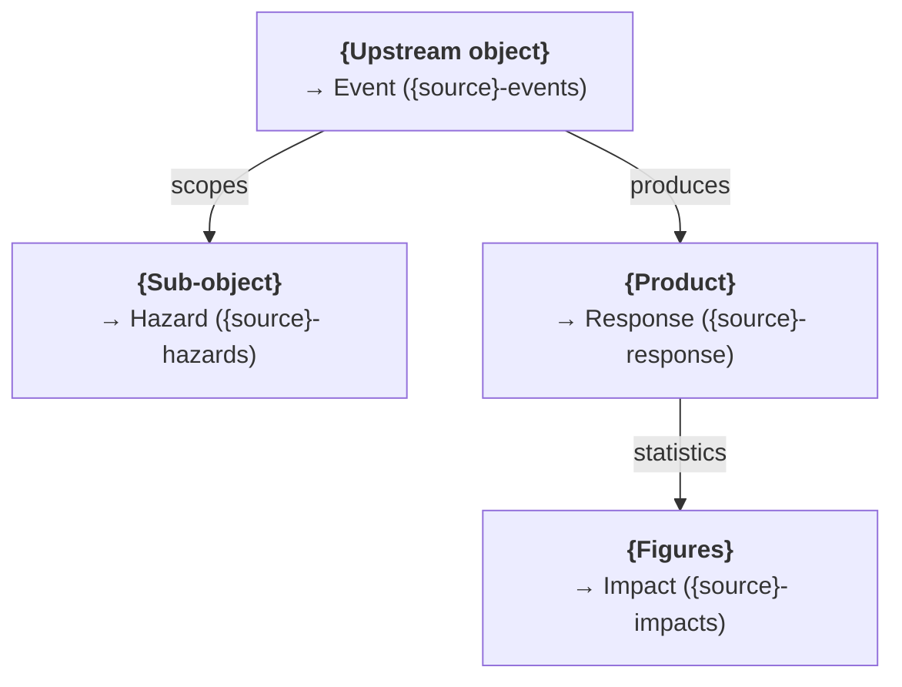

<!--
  SOURCE ANALYSIS TEMPLATE
  ========================
  Copy this file to docs/model/sources/<SOURCE>/README.md and fill it in.
  It captures the structure the two most complete source docs — CEMS and
  Charter — converged on. See ./METHODOLOGY.md for the process this document
  is stage 2 of, and the rules every source doc must follow.

  How to use it:
  - Replace every {placeholder} and each "TODO:" prose block.
  - LINK DEPTH: the cross-reference links below (`../taxonomy.md`, …) are correct
    for this file's location (docs/model/sources/). When you copy it into
    docs/model/sources/<SOURCE>/README.md — one directory deeper — add one more
    `../` to each (`../taxonomy.md` → `../../taxonomy.md`), matching CEMS/Charter.
    `npm run check-docs` validates the links, so a missed `../` fails CI.
  - Keep a section only if it applies. A source with no Response items drops
    the "→ Response" section; a file-drop source with no live API trims
    "Data access" accordingly. Do not keep empty headings.
  - Every mapping claim must be grounded in a committed fixture under
    `api-files/` (rule 2 in METHODOLOGY.md). Cite the fixture.
  - Leave the HTML comments out of the finished doc (or keep short ones as
    editorial notes — CEMS/Charter keep a few).
-->

# {Source name}

<!--
  One paragraph: what the source is, how Montandon accesses it (public REST API /
  partner S3 / file download / …), and what this document maps. State the scope
  boundary up front if the source is larger than what Monty ingests (CEMS maps
  Rapid Mapping only; be explicit about what is out of scope).
-->
TODO: one-paragraph description.

<!--
  Pick ONE framing note as a blockquote and delete the other:
  - Build-from-payload (CEMS): the ETL constructs Monty items from a non-STAC
    payload. Note which extensions the items declare.
  - Pass-through (Charter): the source already publishes STAC; the conversion is
    copy-as-is + Monty specifics. List exactly what the ETL adds/normalises.
-->
> **Scope / conversion principle:** TODO.

## Collections

<!--
  One row per Monty collection this source produces. `Code` is the collection id
  (`{source}-events`, …); `Monty role` is event | hazard | impact | response;
  `Source for` names the upstream object the collection is built from.
  These rows MUST match the source's entry in ./sources.yml (`collections`,
  `types`), which is what gen_sources_index.py checks.
-->

| Collection | Code | Monty role | Source for |
|------------|------|------------|------------|
| {Source} — Events | `{source}-events` | `event` | {upstream object} |
| {Source} — Hazards | `{source}-hazards` | `hazard` | {upstream object} |
| {Source} — Impacts | `{source}-impacts` | `impact` | {upstream object} |
| {Source} — Response | `{source}-response` | `response` | {upstream object} |

<!--
  `Source organisation`, `Organisation type`, `Source URL`, `Contact` and
  `License` restate the source's entry in ./sources.yml, which is authoritative
  for all five — sources.json is generated from it and montandon-website renders
  that. Copy the values across verbatim; if the two disagree, sources.yml wins
  and this doc is the one to fix. `Organisation type` must be one of the closed
  vocabulary listed in that file's field reference.
-->
- **Source organisation**: {org} (`{CODE}`)
- **Organisation type**: {one of the sources.yml org_type vocabulary}
- **Source URL**: <https://example.org>
- **Contact**: <contact@example.org> (or a contact-form URL; omit if the source publishes neither)
- **API / ingestion entry point**: {endpoint or bucket} ({auth: public / partner / key})
- **License**: {license or terms; "None stated by the source" if it publishes none}
- **Temporal coverage**: {from – to}

<!--
  If the source has a native STAC/domain extension (e.g. Charter's Terradue
  `disaster:`), add a short note here on which extensions the Monty items declare
  and the layering-over-duplication rule. Otherwise state "no `{source}:`
  extension exists; source-specific fields are carried under monty: fields".
-->

## Object model

<!--
  Describe the upstream entities and how they relate — the reader must be able to
  follow the graph before the field tables make sense. Prefer a Mermaid diagram
  (flowchart for the process, or an erDiagram for the keying) plus a short prose
  walk-through of any non-obvious association (Charter's call→activation pivot,
  CEMS's activation→AOI→product flow).
-->

<!--
  Then the object → Monty-item mapping, with the deterministic id pattern for each.
  The id pattern is load-bearing: it is what makes re-ingestion idempotent
  (same id ⇒ overwrite in place). Keep every id lowercase and stable.
-->

| {Source} object | Monty type | Monty `id` pattern | Collection |
|-----------------|------------|--------------------|------------|
| {Object} | Event | `{source}-event-{key}` | `{source}-events` |
| {Sub-object} | Hazard | `{source}-hazard-{key}-{type}` | `{source}-hazards` |
| {Product} | Response | `{source}-response-{key}` | `{source}-response` |
| {Figure} | Impact | `{source}-impact-{key}-{thematic}` | `{source}-impacts` |

## Data access

<!--
  The concrete "how to get the bytes": endpoints (with the ETL entry point called
  out), bucket layout, auth, pagination, rate limits, and which single call is the
  "ETL unit". Point at the fixtures in api-files/ that back this section.
-->
TODO: endpoints / layout, auth, pagination, the ETL unit.

Reference fixtures in `api-files/`: TODO (name them and say what each exercises).

## Object → Event

<!--
  One field-carriage table per Monty type the source produces (drop the types it
  doesn't). Two table shapes are in use — pick the one that fits:
    - "source field | Monty field | Notes"  (CEMS: building from a raw payload)
    - "Concept | Carried as | Source"        (Charter: enrich/normalise on STAC)
  Call out the onset-vs-processing datetime trap, and how monty:corr_id is derived
  (always the standard algorithm — never a source primary key).
-->

| {Source} field | Monty field | Notes |
|----------------|-------------|-------|
| `{code}` | `id` (`{source}-event-{code}`) | Prefix `{source}-event-` |
| — | `collection: "{source}-events"` | Required |
| `{onset}` | `datetime` / `start_datetime` | **Event onset**, not the processing/tasking time |
| `{title}` | `title` | |
| `{geometry}` | `geometry` / `bbox` | |
| `{category}` | `monty:hazard_codes` | Map via [Hazard codes](#hazard-codes) |
| `{country}` | `monty:country_codes` | ISO 3166-1 alpha-3 |
| derived | `monty:corr_id` | Standard Monty algorithm — **not** the source key |

## Object → Hazard

<!-- Drop if the source produces no hazard items. -->

| {Source} field | Monty field | Notes |
|----------------|-------------|-------|
| `{id}` | `id` | `{source}-hazard-{key}-{type}` |
| — | `collection: "{source}-hazards"` | Required |
| `{geometry}` | `geometry` | |
| `{type}` | `monty:hazard_codes` | **One UNDRR-ISC 2025 code set per item** — split multi-hazard into one item per code |
| `{severity}` | `monty:hazard_detail` | `severity_value` + `severity_unit` where available |
| parent event | `links[rel=related]` (`roles: ["event"]`) | |

## Object → Response

<!-- Drop if the source produces no response items. -->

| {Source} field | Monty field | Notes |
|----------------|-------------|-------|
| `{product_type}` | `monty:response_detail.type` | A [response taxonomy](../response-taxonomy.md) code (`eo-*`, `hum-*`, …); never encode the source into the code |
| `{source_key}` | `monty:response_detail.source_id` | Source-system anchor |
| `{status}` | `monty:response_detail.status` | Only from an explicit source status field |
| `{geometry}` | `geometry` / `bbox` | Product footprint |
| source imagery | `links[rel=derived_from]` → acquisition item(s) | Sensor extensions (`sat:`/`eo:`/`sar:`) live on the linked acquisition, **not** on the Response |
| upstream page | `links[rel=derived_from]` | Provenance |

> Follow the [Response best practices](../response-best-practices.md) for
> extension layering, and the [Response ↔ Impact boundary rules](../response-impact-boundary.md)
> for what belongs on a Response vs. a paired Impact. **Do not** put
> damage/exposure statistics in `monty:response_detail` — those become Impact items.

## Object → Impact

<!-- Drop if the source produces no impact items. -->

| {Source} field | Monty field | Notes |
|----------------|-------------|-------|
| `{figure}` | `monty:impact_detail.value` | |
| `{category}`/`{type}` | `monty:impact_detail.category` / `.type` | |
| `{unit}` | `monty:impact_detail.unit` | |
| — | `monty:impact_detail.estimate_type` | `primary` unless the source marks otherwise |
| parent product | `links[rel=derived_from]` (`roles: ["response"]`) | Canonical edge: **Impact → derived_from → Response** where the impact is read off a response product |

## Tracking over time

<!--
  How the source evolves and how that evolution reaches Monty. Cover: idempotent
  upsert on stable ids; whether there is a time series (monitoring iterations
  chained by `rel: prev`) vs. in-place revision; and the refresh/polling strategy
  (change signals, what a cheap poll looks like, cadence by lifecycle status).
  Ground any "the API ignores X" claim in a probe. Drop the poll detail for a
  static file-drop source, but still state the refresh cadence.
-->
TODO: update mechanics, idempotency, refresh/polling strategy.

## Cross-source linkage

<!--
  If the source carries hard references to sibling sources (GDACS id, GLIDE
  number, Charter number, …), show how to derive the target Monty item id and
  emit a typed `rel: related` link — with monty:corr_id as the fallback join.
  Note that corr_id is per-source deterministic and NOT a cross-source join key
  (see the caveat in the correlation docs). Drop this section if there are none.
-->
TODO, or delete.

## Hazard codes

<!--
  The crosswalk from the source's own classification to Monty hazard codes.
  VERIFY every code against taxonomy.md before writing the row — a valid code can
  still be the wrong one for the class (METHODOLOGY.md rule 5). UNDRR-ISC 2025 is
  required (exactly one per Hazard item); GLIDE and EM-DAT are recommended.
-->

| {Source} class | UNDRR-ISC 2025 | GLIDE | EM-DAT | Notes / refinement |
|----------------|----------------|-------|--------|--------------------|
| {value} | {GH0000} | {XX} | {nat-xxx-xxx-xxx} | |

> **Every code above is verified against [`taxonomy.md`](../taxonomy.md#complete-2025-hazard-list)**
> and its Cross-Classification Mapping table. Any unmapped or new source class
> MUST fall through to manual review rather than be dropped.

> **`get_canonical_hazard_codes()` does not validate this table.** It preserves any
> syntactically valid UNDRR-ISC 2025 code — it does not check the code is the
> *correct* one for the mapped class. The mapping above must be correct at the
> source; canonicalisation is formatting, not verification.

## Examples

<!--
  Link the worked, fixture-backed Monty items under examples/<source>-<type>/.
  Every example must be reproducible from a committed fixture; hand-written
  examples are provisional until regenerated from the transformer
  (METHODOLOGY.md rule 3).
-->
TODO: link one worked item per collection, e.g. `examples/{source}-events/…`.

## Reference files

<!--
  The upstream fixtures backing this analysis. Placement rule: fixtures go in
  `api-files/` only (METHODOLOGY.md fixture policy), trimmed to the minimum that
  grounds the claims (~1 MB cap for new files).
-->
- `api-files/{…}.json` — TODO: what it exercises.

See `FINDINGS.md` for the raw stage-1 familiarisation notes (optional but recommended).

## Decisions (resolved)

<!--
  Optional but recommended: a table of the mapping questions that were settled,
  with the resolution. Turns "why is it done this way" into a durable record and
  signals the analysis is ETL-ready. See CEMS for the fullest example.
-->

| # | Decision | Resolution |
|---|----------|------------|
| 1 | TODO | TODO |

## Resources

- {Source} portal / docs — TODO
- [Response taxonomy](../response-taxonomy.md) · [Response best practices](../response-best-practices.md) · [Response ↔ Impact boundary](../response-impact-boundary.md)
- [Monty STAC Extension specification](https://github.com/IFRCGo/monty-stac-extension/blob/main/README.md)
