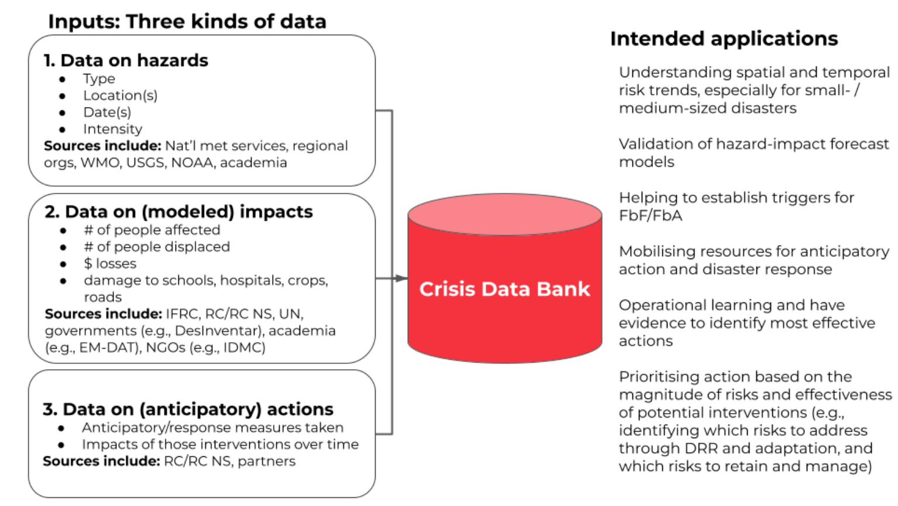
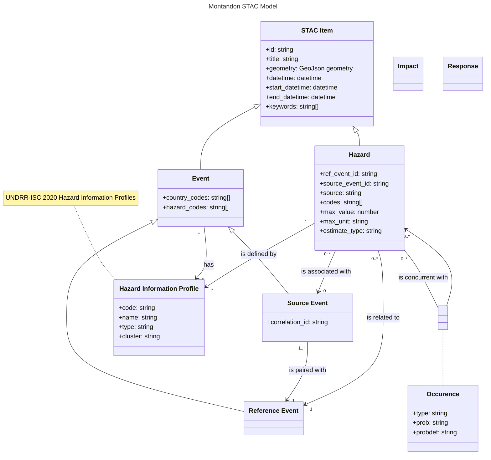

<!-- remark-ignore -->

# Monty Model

The [Monty model](./Montandon_Schema_V1-00.json) is maintained in the [GDBC repository](https://github.com/IFRCGo/GCDB)
and is used to generate the Monty model documentation. 
This JSON schema is the authoritative source for the Monty model and is used to build the STAC model.

## eoAPI risk

The STAC extension aims to provide a way to include Montandon data in STAC items and collections.
eoAPI risk is a flavor of [eoAPI](https://eoapi.dev/) dedicated to risk data.
The Monty model is transformed into a STAC model that is assimilable by the eoAPI data store.

## Model Normalization

The first step in the process is to normalize the Monty model.
This is done by converting the Monty model into a format that is easier to work with and compliant with the STAC specifications model.
The normalized model must keep all the information from the Monty model and cover the applications intented that will use the eoAPI risk data.

### Data Overview

The Monty model is based on **Event** data type that consititutes the core of the model.
In STAC, they will be represented as an item. Then for each event,
3 kinds of data are collected:

- **Hazard**: The type of hazard, its location and the intensity
- **Impact**: All type of impact affecting the population, the infrastructure, the environment, etc
  in terms of number of people affected, financial loss, dmaage to infrastructure, etc.
- **Response**: Anticipatory measures and actions taken in response to the event

The original Monty model is a relational model with a lot of redundant taxonomy attributes in various forms (e.g. country code + name). 
In the STAC model, we try to use unambiguous and normalized attributes as much as possible
but keeping the capacity to query the data with the original taxonomy.
For example, the country code is used as a normalized attribute in a specific field but the country name is kept as a keyword for free text search.

The following classs diagram shows the relationships between the different classes in the Monty model and their high-level attributes.

### Event

The event class is the core of the Monty model. It represents a disaster event that has occured or is forecasted to occur.
The global crisis data bank records multiple instances of events that are related to a single event:

- One unique reference event that is used to "pair" all the instances of the event
- Multiple instances of the event that are recorded for different sources

The event class has the following attributes:

- **id**: A unique identifier for the event. Preferably, the identifier assigned by the issuer (source) of the event.
  - The reference event uses a [?](./questions.md) generated by the Monty system
  - The source events use the identifier assigned by the source (issuer) of the event
- Generated by the Monty system (currently [this method)](https://github.com/IFRCGo/Monty-IFRC/blob/main/API/helpers/DREF_forecasting.R#L13).
  This identifier is used as the correlation id for all the sources events registered in the Monty system.
- **title**: The name of the event assigned by the issuer (source) of the event.
- **geometry** (GeoJSON geometry): The location of the event in the form of a GeoJSON geometry.
  It is recommanded to use a point geometry for the event so that it can be easily searched, displayed and clustered on a map.
  More geometries can be used for the hazard, impact and response data to represent the affected area.
- **datetime**: The date and time when the event occurred.
  For forecasted events, it is the date and time when the event is forecasted to occur.
- **start_datetime**: The date and time when the event started.
  For forecasted events, it is the date and time when the event is forecasted to start. **OPTIONAL**
- **end_datetime**: The date and time when the event ended.
  For forecasted events, it is the date and time when the event is forecasted to end. **OPTIONAL**
- **country_codes**: The country codes of the countries affected by the event.
  The country codes are based on the [ISO 3166-1 alpha-3](https://en.wikipedia.org/wiki/ISO_3166-1_alpha-3) standard.
- **hazard_codes**: The hazard codes of the hazards affecting the event.
  The hazard codes are based on the [UNDRR-ISC 2020 Hazard Information Profiles](https://www.preventionweb.net/drr-glossary/hips)
- **correlation_id**: The unique identifier assigned by the Monty system to the reference event.
  It is used to "pair" all the instances of the event.
- **keywords**: A list of keywords that describe the event. This list includes the human-readable names of
  - the countries affected by the event
  - the hazard types affecting the event

### Hazard

The hazard class represents a process, phenomenon or human activity that may cause loss of life, injury or other health impacts, property damage, social and economic disruption or environmental degradation. UNDRR - https://www.undrr.org/terminology/hazard.
In the Monty model, a hazard is always linked to an event and as per event, every hazard is recorded from multiple sources.

The hazard class has the following attributes:

- **id**: A unique identifier for the hazard. Preferably, the identifier assigned by the issuer (source) of the hazard. If not available, an identifier can be generated and should be prefixed with the related event id.
- **title**: The name of the hazard assigned by the issuer (source) of the hazard.
- **geometry** (GeoJSON geometry): The location of the hazard in the form of a GeoJSON geometry.
- **datetime**: The date and time when the hazard occurrs or is forecasted to occur.
- **start_datetime**: The date and time when the hazard started or is forecasted to start. **OPTIONAL**
- **end_datetime**: The date and time when the hazard ended or is forecasted to end. **OPTIONAL**
- **ref_event_id**: The identifier of the reference event to which is associated the hazard.
- **source_event_id**: The identifier of the source event to which is associated the hazard. **OPTIONAL**
- **source**: Information about the organization and the database capturing, producing, processing, hosting or publishing this data.
- **codes**: The hazard codes defining the hazard.
- **max_value**: The estimated maximum hazard intensity/magnitude/severity value, as a number, without the units.
- **max_unit**: The unit of the estimated maximum hazard intensity/magnitude/severity value.
- **estimate_type**: The type of data source that was used to create this hazard intensity/magnitude/severity estimate:
  - Primary data
  - Secondary data
  - Modelled data: estimated without any event-specific data

Hazards may be linked between each others. This linkage is called "concurrent hazard" and is linking the observed and potentially unobserved hazards together with a specific relationship:

- **Triggers**: as the current hazard triggers the linked hazard. For example, an earthquake triggers a landslide.
- **Triggered by**: as the current hazard is triggered by the linked hazard. For example, a landslide is triggered by an earthquake.
- **Concurrent**: For hazards that do not necessarily trigger one-another, but occur together. For example, thunderstorms can occur together with windstorms or cyclones, thus, we would use 'concurrent'.
- **Complex**: When the relationship between two hazards is complex.

The link has also specific occurence attributes:

- **occurence_type**: the linked hazard actually observed to have occurred with the main hazard, or is this link only a potential link. Montandon allows for hazards to be linked together by actual observed occurrences, or the possibility that the linked hazard occurred with the principal hazard. This is especially useful when handling hazards such as tropical cyclones, whereby more than half of all deaths from cyclones in the US were actually caused by inland flooding.
- **occurence_prob** of the linked hazard occurring with the main hazard. This is a subjective probability, and is not a statistical probability. It is a qualitative assessment of the likelihood of the linked hazard occurring with the main hazard.
- **occurenece_probdef**: definition of occurrence probability is for the hazard relationship. For example, if the probability is 'high', where is 'high' defined?

