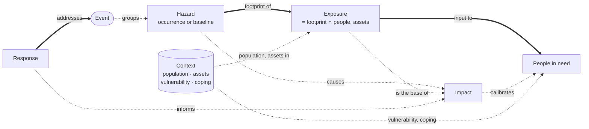
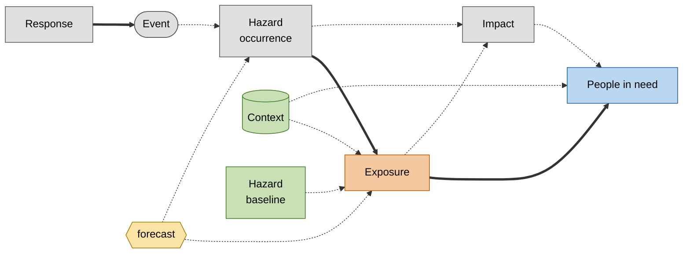

# Montandon risk model options

::subtitle::
Ontology and integration levels<br/>
Core partners · October 2026 · discussion #110

<LogoHorPos position="top-left" height="24px" />

---
layout: default
---

# The question from 23 September

Discussion #110 closed two gaps. The partners agree:

- **Forecast** is a qualifier with an issue time and a valid time (`monty:forecast`).
- **Exposure is not impact.** It goes in separate collections.

The 23 September call asked a larger question:

- Can a hazard exist **without an event**?
- The partners prefer **INFORM** concepts.
- North star: **estimate people in need** for forecast, imminent and recent events.

<div class="mt-6 p-3 border-l-4 border-primary">
This deck proposes an <b>ontology</b> and a <b>ladder of integration levels</b>.<br/>
It is not a decision. It does not define schema fields.
</div>

---
layout: default
class: text-sm
---

# Two meanings of "hazard"

| | Hazard **occurrence** | **Baseline** hazard |
|---|---|---|
| Example | Cyclone NOUL-26 track, 26 July 2026 | 1-in-100-year flood map of Nepal |
| Time | A date, or a forecast valid time | No occurrence time. A return period |
| Becomes an event? | Yes, or it is one already | Never |
| In Montandon today | Yes | No |

<div class="grid grid-cols-2 gap-6 mt-6">
<div>

**Case A — pre-event occurrence**<br/>
A forecast track before anybody declares an event.

</div>
<div>

**Case B — baseline hazard**<br/>
Describes a place. It never becomes an event.

</div>
</div>

Both are a **hazard without an event**. A qualifier must tell a baseline from an occurrence.

---
layout: default
class: text-sm
---

# A risk function with an open signature

UNDRR: disaster risk is "a function of hazard, exposure, vulnerability and capacity".

```text
Risk = f(Hazard, Exposure, [Vulnerability], [Capacity], ...)
```

| Implementation of `f` | How it partitions |
|---|---|
| UNDRR | hazard, exposure, vulnerability, capacity |
| INFORM Risk | (hazard & exposure), vulnerability, lack of coping capacity |
| IPCC AR5 | vulnerability **includes** lack of capacity to cope |
| Loss models (RDLS, GEM) | physical vulnerability (damage curves) |
| Rapid people-in-need estimate | exposed population × vulnerability factor |

**Montandon stores the arguments. The analysis selects `f`.**

---
layout: default
class: text-sm
---

# The key test: is the data tied to a hazard?

*If the hazard footprint changes, does the number change?*

| Figure | Tied to a hazard? | Concept |
|---|---|---|
| 103 M people in the 39 kt wind field (GDACS `pop39`) | Yes | Exposure |
| 1200 deaths reported | Yes | Impact |
| WorldPop population grid of Nepal | No | Context |
| 40 % of a district below the poverty line | No | Context — vulnerability |
| 0.3 physicians per 1000 people | No | Context — coping capacity |

<div class="mt-4 p-3 border-l-4 border-primary">

`Exposure = hazard footprint ∩ population or assets`<br/>
Exposure is where the two kinds of data meet. This is why INFORM has "Hazard & Exposure".

</div>

---
layout: two-cols
gap: 8
class: text-sm
---

# How people in need is estimated

Chain: population → exposed → affected → **in need** → targeted → reached

The rapid, model-based method (anticipatory action, DREF, first 72 h):

```text
PIN(admin) = Σ bands b
  exposed_population(admin, b)
  × p_need(b, vulnerability(admin))
```

::right::

<div class="mt-16" />

| Input | In Montandon today? |
|---|---|
| Hazard footprint, intensity bands | Yes |
| Exposed population per band | Partly (as impact) |
| Population, vulnerability, boundaries | No |
| Past impacts, to calibrate `p_need` | **Yes** |

An event-only Montandon gives the exposure and the calibration data.<br/>
It does not give the vulnerability.

---
layout: default
class: text-sm
---

# Context: data not tied to a hazard

Population grids, poverty indices, coping indicators, admin boundaries.

<div class="mt-4 p-3 border-l-4 border-primary">
<b>Context</b> = the conditions of a place or a population that do not depend on a hazard.
</div>

- From the **JIAF 2.0** pillar "Context": political, socio-cultural, economic, demographic, security and infrastructure characteristics of the area
- Not tied to one risk framework
- In **INFORM** terms: *Vulnerability* and *Lack of coping capacity*
- A **main** input of a people-in-need estimate, not secondary data

---
layout: two-cols
gap: 8
class: text-sm
---

# Vulnerability and coping capacity

If Context holds poverty and coping indicators:

### Kinds of Context

- Categories of Context data
- **For:** fewer concepts; each framework's partition is a value
- **Against:** less visible than Hazard and Exposure

::right::

<div class="mt-24" />

### Concepts of their own

- Same level as Hazard and Exposure
- **For:** matches the INFORM picture
- **Against:** boundary datasets (health access) force a choice

In both cases: **one precise definition each**, and Vulnerability means **social** vulnerability.

---
layout: default
---

# The ontology



**Thick** = mandatory · **dashed** = optional · relations are links, not shared data models.<br/>**Forecast** is a qualifier on hazard, exposure, impact and need.

---
layout: default
class: text-xs
---

# Glossary (extract)

| Montandon term | Definition (draft) | UNDRR | INFORM | RDLS |
|---|---|---|---|---|
| Event | A disaster occurrence, observed or forecast | hazardous event | crisis | event |
| Hazard | A hazard process at a time and place, or its probability (baseline) | hazard | Hazard & Exposure | hazard |
| Exposure | People or assets inside a hazard area | exposure | Hazard & Exposure | exposure |
| Context | Conditions of a place, independent of a hazard | — | Vulnerability; Lack of coping capacity | exposure (baseline) |
| Vulnerability | Social and economic conditions that increase the harm | vulnerability | Vulnerability | vulnerability (**physical**) |
| Coping capacity | Ability to absorb the shock | capacity | Lack of coping capacity | — |
| Impact | Effect of a hazard on people or assets | disaster loss | Impact of the crisis | loss |
| People in need | Estimated people who need assistance | — | Conditions of affected people | — |
| Response | An action or product for an event | response | — | — |

Full crosswalk (JIAF 2.0, IPCC AR5) and the STAC mapping: `docs/model/risk-model-options.md`.

---
layout: default
---

# Levels of integration: a roadmap

Each step adds to the previous one. **Every step is a place to stop.**

<div class="roadmap">
  <div class="track"></div>
  <div class="skip">level 3 can come without level 2</div>
  <div class="steps">
    <div class="step l0">
      <div class="dot">0</div>
      <div class="card"><b>Today</b><span>Events, hazards, impacts, responses</span></div>
      <div class="stop"><b>Stop here:</b> no change. Exposure stays mixed with impact</div>
      <div class="effort">effort: none</div>
    </div>
    <div class="step l1">
      <div class="dot">1</div>
      <div class="card"><b>Event-linked exposure</b><span>Exposure separate from impact</span></div>
      <div class="stop"><b>Stop here:</b> credible figures; exposure for every event</div>
      <div class="effort">effort: low</div>
    </div>
    <div class="step l2 optional">
      <div class="dot">2</div>
      <div class="card"><b>Pre-event occurrences</b><span>Forecast hazards and exposure before an event</span></div>
      <div class="stop"><b>Stop here:</b> anticipatory action</div>
      <div class="effort">effort: medium</div>
    </div>
    <div class="step l3">
      <div class="dot">3</div>
      <div class="card"><b>Analytical results</b><span>People-in-need estimates, linked to their inputs</span></div>
      <div class="stop"><b>Stop here:</b> north-star figure in the catalogue</div>
      <div class="effort">effort: medium</div>
    </div>
    <div class="step l4">
      <div class="dot">4</div>
      <div class="card"><b>Context catalogue</b><span>Population, vulnerability, coping, baseline hazards</span></div>
      <div class="stop"><b>Stop here:</b> all inputs in one place; preparedness</div>
      <div class="effort">effort: high · scope change</div>
    </div>
  </div>
</div>

<div class="mt-4 text-sm">The partners choose a <b>target level</b>. Details on the next slide.</div>

<style>
.roadmap { position: relative; margin-top: 1.5rem; }
.roadmap .track {
  position: absolute; top: 18px; left: 10%; right: 10%; height: 4px;
  background: linear-gradient(90deg, #9e9e9e, #b35c00, #a07800, #1f5f99, #3d7a1f);
}
.roadmap .skip {
  position: absolute; top: -18px; left: 30%; width: 40%; height: 26px;
  border: 2px dashed #1f5f99; border-bottom: none; border-radius: 14px 14px 0 0;
  font-size: 0.65rem; text-align: center; color: #1f5f99; line-height: 1;
  padding-top: 2px;
}
.roadmap .steps { display: grid; grid-template-columns: repeat(5, 1fr); gap: 0.6rem; position: relative; }
.roadmap .step { display: flex; flex-direction: column; align-items: center; gap: 0.45rem; }
.roadmap .dot {
  width: 40px; height: 40px; border-radius: 50%; display: flex; align-items: center; justify-content: center;
  font-weight: 700; font-size: 1.1rem; border: 3px solid var(--c); background: var(--f); color: #000; z-index: 1;
}
.roadmap .card {
  width: 100%; min-height: 96px; padding: 0.5rem 0.6rem; border-radius: 8px;
  background: var(--f); border: 1px solid var(--c); font-size: 0.78rem; line-height: 1.25;
  display: flex; flex-direction: column; gap: 0.3rem;
}
.roadmap .card b { font-size: 0.85rem; }
.roadmap .optional .card { border-style: dashed; border-width: 2px; }
.roadmap .stop {
  width: 100%; min-height: 58px; padding: 0.35rem 0.5rem; border-radius: 6px; font-size: 0.68rem; line-height: 1.2;
  border-left: 4px solid var(--slidev-theme-primary); background: #fff3ec;
}
.roadmap .stop b { color: var(--slidev-theme-primary); }
.roadmap .effort { font-size: 0.65rem; color: #666; }
.roadmap .l0 { --c: #555;    --f: #e0e0e0; }
.roadmap .l1 { --c: #b35c00; --f: #f6c89f; }
.roadmap .l2 { --c: #a07800; --f: #fbe3a6; }
.roadmap .l3 { --c: #1f5f99; --f: #b9d7f0; }
.roadmap .l4 { --c: #3d7a1f; --f: #c8e0b4; }
</style>

---
layout: default
class: text-xs
---

# Levels of integration: details

| Level | Adds | Rules relaxed | People in need | Main risk |
|---|---|---|---|---|
| **0 — Today** | — (exposure filed as impact) | — | Low | Exposure read as impact |
| **1 — Event-linked exposure** | Exposure separate from impact | None | Exposure available | Small |
| **2 — Pre-event occurrences** | Forecast hazards and exposure before an event | "Hazard always linked to an event" | Early exposure | Links only at query time |
| **3 — Analytical results** | People-in-need estimates, linked to inputs and versions | None | Result stored | Accountability for a published figure |
| **4 — Context catalogue** | Context datasets and baseline hazards | Event link; `hazard_codes` for Context | All inputs in one place | Scope change; duplicates INFORM, HDX, RDL |


---
layout: default
---

# The ladder, as concepts



Grey = level 0 · orange = 1 · yellow = 2 · blue = 3 · green = 4 · **thick** = mandatory · **dashed** = optional

---
layout: default
class: text-sm
---

# Cyclone NOUL-26 up the ladder

GDACS event 1001294, episode 13

| Level | What Montandon holds |
|---|---|
| 0 | `pop39` = 103 014 755 filed as an impact (`potentially_affected`) |
| 1 | `pop39` and `pop74` are **Exposure** items, linked to the hazard, with their wind threshold |
| 2 | Forecast track positions (advisory 13) are hazard items with `monty:forecast`. Their exposure exists before any event is declared |
| 3 | A notebook combines exposure per wind band with district vulnerability, and writes a people-in-need estimate per district, linked to its inputs |
| 4 | The population grid and the vulnerability dataset are Context items. The notebook finds them by location |

---
layout: default
class: text-sm
---

# Tibet earthquake 2025 up the ladder

USGS `us6000pi9w` · M 7.1 · 7 January 2025 · PAGER: red (economic), orange (fatalities)

| Level | What Montandon holds |
|---|---|
| 0 | ShakeMap hazard. PAGER impacts: 858 deaths, USD 1 billion (`modelled`). Exposure data only as an asset |
| 1 | **Exposure** per country and MMI: 2 998 people at MMI IX (China) · 19.3 M at MMI IV (Nepal) · 130.9 M at MMI IV in total, who felt light shaking but were not harmed. Reported toll: 126 deaths (`primary`) |
| 2 | **Not applicable**: earthquakes are not forecast. Level 2 depends on the hazard type |
| 3 | People-in-need estimate from exposure at MMI VI+. Main factor: **physical** vulnerability (adobe, unreinforced brick) |
| 4 | Context: population grid, building stock. Baseline hazard: seismic hazard map (GEM). No INFORM subnational model for Nepal |

<div class="mt-3 p-3 border-l-4 border-primary">
Exposure crosses borders: the event is in China, most exposed people are in India and Nepal.<br/>
Physical vulnerability matters for earthquakes. It tests the choice of social vulnerability.
</div>

---
layout: default
---

# Questions for the partners

1. What is the **target level**, and what is the path to it?
2. Vulnerability and coping capacity: **concepts**, or **kinds of Context**?
3. Do we agree that vulnerability means **social** vulnerability?
4. Level 3: who is accountable for a people-in-need figure that Montandon publishes?
5. Level 4: which Context datasets do the use cases need? Which stay with their publishers?

<div class="mt-6 p-3 border-l-4 border-primary text-sm">
For the Nepal use case: INFORM has subnational models for Bangladesh and Myanmar, but <b>not for Nepal</b>.
</div>

<LogoHorPos position="bottom-right" height="24px" />
