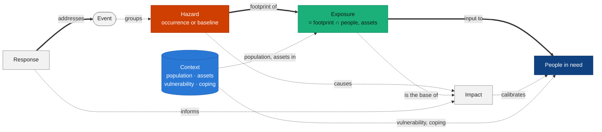
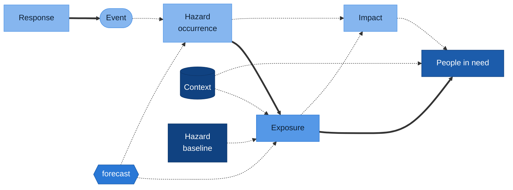

# Montandon risk model options

::subtitle::
Ontology and integration levels<br/>
Core partners · October 2026 · discussion #110

<LogoHorPos position="top-left" height="24px" />

---
layout: default
---

# This is a risk-modelling question

<RiskIntro />

<div class="text-sm">Risk exists <b>before</b> an event. Montandon records what happens <b>after</b>. The question is how far Montandon goes toward risk.</div>

---
layout: default
---

# The question from 23 September

<div class="flow">
  <div class="fc done">
    <div class="k">Discussion #110 · agreed</div>
    <div class="t">Two gaps closed</div>
    <ul><li><b>Forecast</b> is a qualifier (issue time, valid time)</li><li><b>Exposure is not impact</b>: separate collections</li></ul>
  </div>
  <div class="arrow">→</div>
  <div class="fc open">
    <div class="k">Call of 23 September · open</div>
    <div class="t">Can a hazard exist without an event?</div>
    <ul><li>The partners prefer <b>INFORM</b> concepts</li><li>Montandon has been event-based until now</li></ul>
  </div>
  <div class="arrow">→</div>
  <div class="fc star">
    <div class="k">North star</div>
    <div class="t">Estimate people in need</div>
    <ul><li>for forecast, imminent and recent events</li></ul>
  </div>
</div>

<div class="mt-8 p-3 border-l-4 border-primary">
This deck proposes an <b>ontology</b> and a <b>roadmap of integration levels</b>.<br/>
It is not a decision. It does not define schema fields.
</div>

<style>
.flow { display: grid; grid-template-columns: 1fr auto 1fr auto 1fr; gap: 0.6rem; align-items: stretch; margin-top: 1.5rem; }
.fc { border-radius: 10px; padding: 0.8rem 1rem; font-size: 0.85rem; border: 2px solid #ccc; }
.fc .k { font-size: 0.7rem; text-transform: uppercase; letter-spacing: 0.04em; color: #666; }
.fc .t { font-weight: 700; font-size: 1.05rem; margin: 0.3rem 0 0.4rem; line-height: 1.2; }
.fc ul { margin: 0; padding-left: 1rem; }
.fc.done { background: #f2f2f2; }
.fc.open { border-color: #cf3f02; background: #fff3ec; }
.fc.star { border-color: #104281; background: #eef4fc; }
.arrow { align-self: center; font-size: 1.8rem; color: #999; }
</style>

---
layout: default
---

# Two meanings of "hazard"

<HazardMeanings />

Both cases are a **hazard without an event**. A qualifier must tell a baseline from an occurrence.

---
layout: default
---

# A risk function with an open signature

<div class="text-sm">UNDRR: disaster risk is the potential loss "determined probabilistically as a function of hazard, exposure, vulnerability and capacity".</div>

<RiskMatrix />

<div class="mt-4"><b>Montandon stores the arguments. The analysis selects <code>f</code>.</b></div>

---
layout: default
---

# The key test

*If the hazard footprint changes, does the number change?*

<div class="grid grid-cols-[55%_45%] gap-6 items-start">
<div>
<FootprintTest />
</div>
<div>

<div class="tests text-sm">
  <div class="row"><span class="chip yes">yes</span> 103 M people in the 39 kt wind field <span class="c exp">Exposure</span></div>
  <div class="row"><span class="chip yes">yes</span> 12 hospitals in the flood extent <span class="c exp">Exposure</span></div>
  <div class="row"><span class="chip yes">yes</span> 1200 deaths reported <span class="c imp">Impact</span></div>
  <div class="row"><span class="chip no">no</span> WorldPop grid of Nepal <span class="c ctx">Context</span></div>
  <div class="row"><span class="chip no">no</span> 40 % below the poverty line <span class="c ctx">Context</span></div>
  <div class="row"><span class="chip no">no</span> 0.3 physicians / 1000 people <span class="c ctx">Context</span></div>
</div>

<div class="mt-4 p-3 border-l-4 border-primary text-sm">
<code>Exposure = footprint ∩ people, assets</code>
</div>

</div>
</div>

<style>
.tests .row { display: flex; align-items: center; gap: 0.5rem; padding: 0.35rem 0; border-bottom: 1px solid #eee; }
.chip { font-size: 0.7rem; font-weight: 700; border-radius: 999px; padding: 0 0.5rem; border: 1.5px solid #3f3f3f; }
.chip.no { border-style: dashed; color: #666; border-color: #999; }
.c { margin-left: auto; font-weight: 700; padding-left: 0.6rem; border-left: 6px solid; }
.c.exp { border-color: #1baf7a; }
.c.ctx { border-color: #2a78d6; }
.c.imp { border-color: #8a8a8a; }
</style>

---
layout: default
---

# How people in need is estimated

<div class="max-w-[88%]"><PinFunnel /></div>

<div class="grid grid-cols-2 gap-8 text-xs">
<div>

Rapid, model-based method (anticipatory action, DREF, first 72 h):

```text
PIN(admin) = Σ over intensity bands b of
     exposed_population(admin, b)
   × p_need(b, vulnerability(admin))
```

</div>
<div>

| Input | In Montandon today? |
|---|---|
| Hazard footprint, intensity bands | Yes |
| Exposed population per band | Partly (as impact) |
| Population, vulnerability | No |
| Past impacts (calibration) | **Yes** |

</div>
</div>

---
layout: default
---

# Context: data not tied to a hazard

<div class="grid grid-cols-[55%_45%] gap-6 items-start">
<div>
<ContextLayers />
</div>
<div>

<div class="p-3 border-l-4 border-primary">
<b>Context</b> = the conditions of a place or a population that do not depend on a hazard.
</div>

- From the **JIAF 2.0** pillar "Context"
- Not tied to one risk framework
- In **INFORM** terms: *Vulnerability* and *Lack of coping capacity*
- A **main** input of a people-in-need estimate, not secondary data

</div>
</div>

---
layout: default
class: text-sm
---

# Vulnerability and coping capacity

<div class="grid grid-cols-2 gap-10 mt-4">
<div>

### A — Kinds of Context

<div class="opt">
  <div class="box ctx big">Context
    <div class="kids"><span>population</span><span>assets</span><span class="hl">vulnerability</span><span class="hl">coping capacity</span></div>
  </div>
  <div class="peers"><span class="box haz">Hazard</span><span class="box exp">Exposure</span></div>
</div>

- **For:** fewer concepts; each framework's partition is a value
- **Against:** less visible than Hazard and Exposure

</div>
<div>

### B — Concepts of their own

<div class="opt">
  <div class="peers"><span class="box haz">Hazard</span><span class="box exp">Exposure</span><span class="box ctx">Vulnerability</span><span class="box ctx">Coping capacity</span></div>
  <div class="box ctx small">Context: population, assets</div>
</div>

- **For:** matches the INFORM picture
- **Against:** boundary datasets (health access) force a choice

</div>
</div>

<div class="mt-4 p-2 border-l-4 border-primary">In both cases: one precise definition each. Vulnerability means <b>social</b> vulnerability.</div>

<style>
.opt { display: flex; flex-direction: column; gap: 0.6rem; margin: 0.6rem 0 1rem; min-height: 130px; }
.box { border-radius: 8px; padding: 0.4rem 0.7rem; font-weight: 700; display: inline-block; }
.box.haz { background: #cf3f02; color: #fff; }
.box.exp { background: #1baf7a; color: #0d1f17; }
.box.ctx { background: #2a78d6; color: #fff; }
.box.big { display: block; }
.box.small { font-weight: 400; align-self: flex-start; }
.kids { display: flex; flex-wrap: wrap; gap: 0.4rem; margin-top: 0.5rem; }
.kids span { border: 1px solid rgba(255,255,255,0.7); border-radius: 6px; padding: 0.1rem 0.5rem; font-weight: 400; }
.kids span.hl { background: #fff; color: #104281; font-weight: 700; }
.peers { display: flex; gap: 0.5rem; flex-wrap: wrap; }
</style>

---
layout: default
---

# The ontology



**Thick** = mandatory · **dashed** = optional · relations are links, not shared data models.<br/>**Forecast** is a qualifier on hazard, exposure, impact and need.

---
layout: default
class: text-xs
---

# Glossary (extract)

| Montandon term | Definition (draft) | UNDRR | INFORM | RDLS |
|---|---|---|---|---|
| Event | A disaster occurrence, observed or forecast | hazardous event | crisis | event |
| Hazard | A hazard process at a time and place, or its probability (baseline) | hazard | Hazard & Exposure | hazard |
| Exposure | People or assets inside a hazard area | exposure | Hazard & Exposure | exposure |
| Context | Conditions of a place, independent of a hazard | — | Vulnerability; Lack of coping capacity | exposure (baseline) |
| Vulnerability | Social and economic conditions that increase the harm | vulnerability | Vulnerability | vulnerability (**physical**) |
| Coping capacity | Ability to absorb the shock | capacity | Lack of coping capacity | — |
| Impact | Effect of a hazard on people or assets | disaster loss | Impact of the crisis | loss |
| People in need | Estimated people who need assistance | — | Conditions of affected people | — |
| Response | An action or product for an event | response | — | — |

Full crosswalk (JIAF 2.0, IPCC AR5) and the STAC mapping: `docs/model/risk-model-options.md`.

---
layout: default
---

# Levels of integration: a roadmap

Each step adds to the previous one. **Every step is a place to stop.**

<div class="roadmap">
  <div class="track"></div>
  <div class="skip">level 3 can come without level 2</div>
  <div class="steps">
    <div class="step l0">
      <div class="dot">0</div>
      <div class="card"><b>Today</b><span>Events, hazards, impacts, responses</span></div>
      <div class="stop"><b>Stop here:</b> no change. Exposure stays mixed with impact</div>
      <div class="effort">effort: none</div>
    </div>
    <div class="step l1">
      <div class="dot">1</div>
      <div class="card"><b>Event-linked exposure</b><span>Exposure separate from impact</span></div>
      <div class="stop"><b>Stop here:</b> credible figures; exposure for every event</div>
      <div class="effort">effort: low</div>
    </div>
    <div class="step l2 optional">
      <div class="dot">2</div>
      <div class="card"><b>Pre-event occurrences</b><span>Forecast hazards and exposure before an event</span></div>
      <div class="stop"><b>Stop here:</b> anticipatory action</div>
      <div class="effort">effort: medium</div>
    </div>
    <div class="step l3">
      <div class="dot">3</div>
      <div class="card"><b>Analytical results</b><span>People-in-need estimates, linked to their inputs</span></div>
      <div class="stop"><b>Stop here:</b> north-star figure in the catalogue</div>
      <div class="effort">effort: medium</div>
    </div>
    <div class="step l4">
      <div class="dot">4</div>
      <div class="card"><b>Context catalogue</b><span>Population, vulnerability, coping, baseline hazards</span></div>
      <div class="stop"><b>Stop here:</b> all inputs in one place; preparedness</div>
      <div class="effort">effort: high · scope change</div>
    </div>
  </div>
</div>

<div class="mt-4 text-sm">The partners choose a <b>target level</b>. Details on the next slide.</div>

<style>
.roadmap { position: relative; margin-top: 1.5rem; }
.roadmap .track {
  position: absolute; top: 18px; left: 10%; right: 10%; height: 4px;
  background: linear-gradient(90deg, #86b6ef, #5598e7, #2a78d6, #1c5cab, #104281);
}
.roadmap .skip {
  position: absolute; top: -18px; left: 30%; width: 40%; height: 26px;
  border: 2px dashed #1c5cab; border-bottom: none; border-radius: 14px 14px 0 0;
  font-size: 0.65rem; text-align: center; color: #1c5cab; line-height: 1;
  padding-top: 2px;
}
.roadmap .steps { display: grid; grid-template-columns: repeat(5, 1fr); gap: 0.6rem; position: relative; }
.roadmap .step { display: flex; flex-direction: column; align-items: center; gap: 0.45rem; }
.roadmap .dot {
  width: 40px; height: 40px; border-radius: 50%; display: flex; align-items: center; justify-content: center;
  font-weight: 700; font-size: 1.1rem; border: 3px solid #fff; box-shadow: 0 0 0 2px var(--c); background: var(--c); color: var(--t); z-index: 1;
}
.roadmap .card {
  width: 100%; min-height: 96px; padding: 0.5rem 0.6rem; border-radius: 8px;
  background: color-mix(in srgb, var(--c) 12%, white); border: 1px solid var(--c); font-size: 0.78rem; line-height: 1.25;
  display: flex; flex-direction: column; gap: 0.3rem;
}
.roadmap .card b { font-size: 0.85rem; }
.roadmap .optional .card { border-style: dashed; border-width: 2px; }
.roadmap .stop {
  width: 100%; min-height: 58px; padding: 0.35rem 0.5rem; border-radius: 6px; font-size: 0.68rem; line-height: 1.2;
  border-left: 4px solid var(--slidev-theme-primary); background: #fff3ec;
}
.roadmap .stop b { color: var(--slidev-theme-primary); }
.roadmap .effort { font-size: 0.65rem; color: #666; }
.roadmap .l0 { --c: #86b6ef; --t: #0d1f33; }
.roadmap .l1 { --c: #5598e7; --t: #0d1f33; }
.roadmap .l2 { --c: #2a78d6; --t: #fff; }
.roadmap .l3 { --c: #1c5cab; --t: #fff; }
.roadmap .l4 { --c: #104281; --t: #fff; }
</style>

---
layout: default
class: text-xs
---

# Levels of integration: details

| Level | Adds | Rules relaxed | People in need | Main risk |
|---|---|---|---|---|
| **0 — Today** | — (exposure filed as impact) | — | Low | Exposure read as impact |
| **1 — Event-linked exposure** | Exposure separate from impact | None | Exposure available | Small |
| **2 — Pre-event occurrences** | Forecast hazards and exposure before an event | "Hazard always linked to an event" | Early exposure | Links only at query time |
| **3 — Analytical results** | People-in-need estimates, linked to inputs and versions | None | Result stored | Accountability for a published figure |
| **4 — Context catalogue** | Context datasets and baseline hazards | Event link; `hazard_codes` for Context | All inputs in one place | Scope change; duplicates INFORM, HDX, RDL |


---
layout: default
---

# The ladder, as concepts



Light → dark blue = level 0 → 4 · **thick** = mandatory · **dashed** = optional

---
layout: default
---

# NOUL-26: observed, then forecast

<NoulExposure />

Both gaps from #110 in one chart: a **forecast** needs its own qualifier, and **exposure** is not impact.

---
layout: default
class: text-sm
---

# Cyclone NOUL-26 up the ladder

GDACS event 1001294, episode 13

| Level | What Montandon holds |
|---|---|
| 0 | `pop39` = 103 014 755 filed as an impact (`potentially_affected`) |
| 1 | `pop39` and `pop74` are **Exposure** items, linked to the hazard, with their wind threshold |
| 2 | Forecast track positions (advisory 13) are hazard items with `monty:forecast`. Their exposure exists before any event is declared |
| 3 | A notebook combines exposure per wind band with district vulnerability, and writes a people-in-need estimate per district, linked to its inputs |
| 4 | The population grid and the vulnerability dataset are Context items. The notebook finds them by location |

---
layout: default
---

# Tibet earthquake 2025: who was exposed

USGS `us6000pi9w` · M 7.1 · 7 January 2025

<MmiExposure />

130.9 M people felt light shaking. 2 998 were at MMI IX. Reported toll: 126 deaths.

---
layout: default
class: text-sm
---

# Tibet earthquake 2025 up the ladder

USGS `us6000pi9w` · M 7.1 · 7 January 2025 · PAGER: red (economic), orange (fatalities)

| Level | What Montandon holds |
|---|---|
| 0 | ShakeMap hazard. PAGER impacts: 858 deaths, USD 1 billion (`modelled`). Exposure data only as an asset |
| 1 | **Exposure** per country and MMI: 2 998 people at MMI IX (China) · 19.3 M at MMI IV (Nepal) · 130.9 M at MMI IV in total, who felt light shaking but were not harmed. Reported toll: 126 deaths (`primary`) |
| 2 | **Not applicable**: earthquakes are not forecast. Level 2 depends on the hazard type |
| 3 | People-in-need estimate from exposure at MMI VI+. Main factor: **physical** vulnerability (adobe, unreinforced brick) |
| 4 | Context: population grid, building stock. Baseline hazard: seismic hazard map (GEM). No INFORM subnational model for Nepal |

<div class="mt-3 p-3 border-l-4 border-primary">
Exposure crosses borders: the event is in China, most exposed people are in India and Nepal.<br/>
Physical vulnerability matters for earthquakes. It tests the choice of social vulnerability.
</div>

---
layout: default
---

# Questions for the partners

1. What is the **target level**, and what is the path to it?
2. Vulnerability and coping capacity: **concepts**, or **kinds of Context**?
3. Do we agree that vulnerability means **social** vulnerability?
4. Level 3: who is accountable for a people-in-need figure that Montandon publishes?
5. Level 4: which Context datasets do the use cases need? Which stay with their publishers?

<div class="mt-6 p-3 border-l-4 border-primary text-sm">
For the Nepal use case: INFORM has subnational models for Bangladesh and Myanmar, but <b>not for Nepal</b>.
</div>

<LogoHorPos position="bottom-right" height="24px" />
